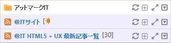

# Composite RSS Reader Gadget

Composite RSS Reader Gadget is the Gadget to display RSS Reader Gadgets collectively.

This page explains the controls and the operations of the Composite RSS Reader Gadget.
Because there are functions duplicated with RSS Reader Gadget, some descriptions are omitted in this page. Refer to [RSS Reader Gadget] page.

![Composite RSS Reader Gadget]

<table>
    <thead>
        <tr>
            <th>No</th><th>Name</th><th>Description</th>
        </tr>
    </thead>
    <tbody>
        <tr>
            <td>(1)</td>	
            <td>Title</td>
            <td>
                

                    The title of the Gadget. 
                    The concerned site is displayed by clicking the link that is set.
                

            </td>
        </tr>
        <tr>
            <td>(2)</td>
            <td>Icons</td>
            <td>
                

                    These icons are used to execute Composite RSS Reader Gadget functions. 
                    Refer to the following table for the icon description.
                

            </td>
        </tr>
        <tr>
            <td>(3)</td>
            <td>Category title</td>
            <td>
                

                    The title of each category that is displayed in the Composite RSS Reader Gadget is displayed. 
                    The content of the setting site is displayed by clicking the link that is set.
                

            </td>
        </tr>
        <tr>
            <td>(4)</td>
            <td>Category icon</td>
            <td>
                

                    There are icons for the title bar of the Gadget and the title bar of each category in Composite RSS Reader Gadget. 
                    It is possible to operate all Gadgets on the Composite RSS Reader Gadget by using the icons on the top title bar. However, it is only possible to operate categories by using icons on the title bar of categories.
                

            </td>
        </tr>
    </tbody>
</table>

## Description of Header Icon

<table>
    <thead>
        <tr>
            <th>Icon</th><th>Name</th><th>Description</th>
        </tr>
    </thead>
    <tbody>
        <tr>
            <td></td>
            <td>Refresh</td>
            <td>
                

                    Reload a RSS. 
                    <strong>Note:</strong> Normally, RSS Reader Gadgets are automatically updated according to the setting time of server. 
                    The new arrival icon rotates to inform that the RSS item has been updated since the last display.
                

            </td>
        </tr>
        <tr>
            <td></td>
            <td>Minimize/Display number of new arrival items</td>
            <td>
                

                    When minimizing a Gadget, the icon turns into Restore icon. 
                    
                    When minimizing, the sun shaped icon is displayed and the number of new arrival items is displayed.
                

            </td>
        </tr>
        <tr>
            <td></td>
            <td>Restore</td>
            <td>
                
Restore the minimized Gadget.

            </td>
        </tr>
        <tr>
            <td></td>
            <td>Maximize</td>
            <td>
                
Maximize a Gadget. Refer to the following part for the description of the maximized RSS Reader Gadget.

            </td>
        </tr>
        <tr>
            <td></td>
            <td>Show Menu</td>
            <td>
                
Open the menu of Gadget.

            </td>
        </tr>
    </tbody>
</table>

## Description of the Menu

Menu of Gadget is opened if Show Menu(![Gadget Menu icon])icon is clicked.

![Gadget menu]

<table>
    <thead>
        <tr>
            <th>Icon</th><th>Name</th><th>Description</th>
        </tr>
    </thead>
    <tbody>
        <tr>
            <td></td>
            <td>Edit</td>
            <td>
                

                    The following gadget settings is displayed by clicking this icon. 
                     
                    <ul>
                        <li>Gadget title: Type title of Gadget.</li>
                        <li>Start a new line: select whether to start a new line to display titles or to hide the part that cannot be displayed in one line.</li>
                        <li>Display date: switch display or hide the date updated.</li>
                        <li>Change the number of the results to be displayed: the number of the results to be displayed can be select in pull-down list.</li>
                        <li>Scroll mode:
                            <ul>
                                <li>Scroll: make the scroll function valid.</li>
                                <li>None: make the scroll function invalid.</li>
                            </ul>
                        </li>
                        <li>Detail display mode: set the display methods for details.
                            <ui>
                                <li>Inline: display details under the selected item in RSS Reader Gadget.</li>
                                <li>Popup: display details in the popup window for displaying details.</li>
                            </ul>
                        </li>
                        <li>Content display mode: set a target when clicking a link of RSS item.
                            <ul>
                                <li>Frame in portal: display the linked web site in a frame in portal.</li>
                                <li>New window: display the linked web site in a new window.</li>
                                <li>Auto detect: let the system to apply either of the above automatically.</li>
                            </ul>
                        </li>
                        <li>icon: display the source of RSS. Use it if getting URL of RSS.</li>
                    </ul>
                    <strong>CANCEL:</strong> Close the gadget settings without saving the setting.
                    <strong>OK:</strong> Save the setting and then close the gadget settings.
                

            </td>
        </tr>
        <tr>
            <td></td>
            <td>Decrease the number of displayed items</td>
            <td>
                
Decrease displayed RSS item by one.

            </td>
        </tr>
        <tr>
            <td></td>
            <td>Increase the number of displayed items</td>
            <td>
                
Increase displayed RSS item by one.

            </td>
        </tr>
        <tr>
            <td></td>
            <td>Display according to time order</td>
            <td>
                

                    Integrate all category and switch to the items in time order.  
                    However, the time order is not sorted correctly if the item is not in valid format.
                

            </td>
        </tr>
        <tr>
            <td></td>
            <td>Display according to category</td>
            <td>
                
Switch display according to categories.

            </td>
        </tr>
        <tr>
            <td></td>
            <td>Search</td>
            <td>
                

                    Display a search box to search in the site. 
                    Click any place except for the search box to close search box. 
                    Searching in the site function can be used if it is valid in the system setting.
                

            </td>
        </tr>
        <tr>
            <td></td>
            <td>Display/Hide the detail date</td>
            <td>
                
Switch display or hide the date updated.

            </td>
        </tr>
        <tr>
            <td></td>
            <td>Line breaks</td>
            <td>
                
Displaying the title of RSS item with a new line or Hiding the part that cannot be displayed in a line is able to be selected.

            </td>
        </tr>
        <tr>
            <td></td>
            <td>Delete</td>
            <td>
                
Delete Gadget from personalized area.

            </td>
        </tr>
    </tbody>
</table>

## Maximizing Composite RSS Reader Gadget

If you click "Maximize" icon in a Widget header, the maximized Composite RSS Reader Gadget is displayed.

![Maximizing Composite RSS Reader Gadget]

Depending on the setting, RSS item is displayed according to the registered categories or displayed all collectively. Other operations are same as "Maximize RSS Reader Gadget". Refer to User Guide / <a href="rss-reader-gadget.md#maximize">Maximizing RSS Reader Gadget</a> for the operations of maximizing Gadget.

## Switching of the Display According to Category and the Integration(According to Time Order) Display

All categories are integrated and displayed in the time order by clicking the icon when Composite RSS is displaying according to category.

RSS icon is displayed according to categories if icon is clicked at the integration display mode.

![Display According to Category]

The displayed icon is the icon that switches to show the time order ![Display According] when the category is displayed.

![Display According to Time Order]

The displayed icon is the icon that switches to show category [Display According] when the category is displayed.

## Merging RSS Reader Gadget

The merge confirmation dialog is displayed if the menu or the Gadget is dragged, and dropped in RSS Reader Gadget or Composite RSS Reader Gadget.

![Merge confirm dialog]

The Gadget returns to the its condition before dragging if **Do not merge(Back)** is clicked.
The menu or the Gadget is added or generated in Composite RSS Reader Gadget if **Merge** is clicked.

![After merged]

[RSS Reader Gadget]: rss-reader-gadget.md
[Composite RSS Reader Gadget]: images/widget/composite-rss-reader-gadget-1.png
[Gadget menu]: images/widget/composite-rss-reader-gadget-3.png
[Maximizing Composite RSS Reader Gadget]: images/widget/composite-rss-reader-gadget-5.png
[Display According to Category]: images/widget/composite-rss-reader-gadget-6.png
[Display According to Time Order]: images/widget/composite-rss-reader-gadget-7.png
[Merge confirm dialog]: images/widget/composite-rss-reader-gadget-8.png
[After merged]: images/widget/composite-rss-reader-gadget-9.png
[Display According]: ../../images/display_sort.gif
[Gadget Menu icon]: ../../images/show_hidden_icons.gif
