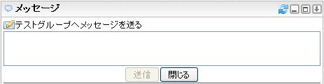
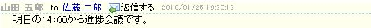
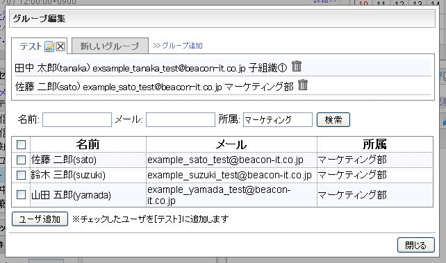

# Message Gadget

This page explains the controls and the operations of Message Gadget.

![message_gadget_jp]

<table>
	<thead>
	<tr>
    	<th>No</th>
        <th>Name</th>
        <th>Description</th>
    </tr>
    </thead>
    <tbody>
	<tr>
    	<td>(1)</td>
        <td>Title</td>
        <td>The title of the gadget. The related site is displayed by clicking the link that was set.</td>
    </tr>
	<tr>
    	<td>(2)</td>
        <td>Header Icon</td>
        <td>The control to execute functions of Message Gadget. Refer to the following table for each icon's description.</td>
    </tr>
	<tr>
    	<td>(3)</td>
        <td>Public Message</td>
        <td>The form to enter a public message is displayed by clicking it. </td>
    </tr>
	<tr>
    	<td>(4)</td>
        <td>System Group</td>
        <td>
			<ul>
		    	<li>Received message By clicking  icon, RSS reader which shows the user's received messages is
added.</li>
		    	<li>Sent message By clicking  icon, RSS reader which shows the public messages and usual messages that were sent by the user is added.</li>
		    	<li>Information By clicking  icon, RSS reader which shows messages that were sent as Information is added. By clicking  icon, the form to send messages to all users is displayed. The icon is not displayed if it is not allowed under system settings. </li>
		    	<li>All users's public message By cliking  icon, RSS reader which shows public messages of all users and
the user's received messages is added.</li>
		    </ul>
		</td>
    </tr>
	<tr>
    	<td>(5)</td>
        <td>User Group Header</td>
        <td>User group name is displayed. By clicking  icon, RSS reader which shows all public messages that were sent by the user group members and messages to yourself is added.  icon shows the form to send a message to all of the user group members. </td>
    </tr>
	<tr>
    	<td>(6)</td>
        <td>User Group</td>
        <td>List of users who belong to the user group is displayed. By clicking  icon on the right of each username, RSS reader which shows public messages from the user and messages to yourself is added.  icon shows the form to send a message to the specific user.</td>
    </tr>
    </tbody>
</table>

## Header Icon Descriptions

<table>
    <thead>
        <tr>
            <th>Icon</th>
            <th>Name</th>
            <th>Description</th>
        </tr>
    </thead>
    <tbody>
	<tr>
    	<td></td>
    	<td>Refresh</td>
        <td>Check new messages. They are automatically checked every ten minutes with the default system setting for gadget. This icon should be used when manual checking is preferred.</td>
    </tr>
	<tr>
    	<td></td>
    	<td>Minimize</td>
        <td>Minimize gadgets. When a gadget is minimized, the icon is switched to  icon, which restore the gadget to the original size.</td>
    </tr>
	<tr>
    	<td></td>
    	<td>Restore</td>
        <td>Restore a gadget to the original size.</td>
    </tr>
	<tr>
    	<td></td>
    	<td>Maximize</td>
        <td>Maximize gadgets. The description of maximized message gadget is mentioned later on in this page.</td>
    </tr>
	<tr>
    	<td></td>
    	<td>Show Menu</td>
        <td>Show menu of the gadget.</td>
    </tr>
    </tbody>
</table>

## Menu Descriptions

When [Show menu] ![Gadget Menu icon] icon is clicked, gadget menu is opend.

<table>
    <thead>
        <tr>
            <th>Icon</th>
            <th>Name</th>
            <th>Description</th>
        </tr>
    </thead>
    <tbody>
	<tr>
    	<td></td>
    	<td>Edit Group</td>
        <td>Show the window to edit group. The description of the window to edit group is mentioned later.</td>
    </tr>
	<tr>
    	<td></td>
    	<td>Delete</td>
        <td>Delete the gadget from personalized area.</td>
    </tr>
    </tbody>
</table>

## Maximizing Message Gadget

When [Maximize] icon is clicked, maximized Message Gadget is displayed as follows.

![message_gadget_maximize_jp]

<table>
    <thead>
	<tr>
    	<th>No</th>
    	<th>Name</th>
        <th>Description</th>
    </tr>
    </thead>
    <tbody>
	<tr>
    	<td>(1)</td>
    	<td>Header Icon</td>
        <td>The control to execute functions of maximized Message Gadget. Refer to the following table for each icon's description.</td>
    </tr>
	<tr>
    	<td>(2)</td>
    	<td>Public Message</td>
        <td>Show the form to enter a public message.</td>
    </tr>
	<tr>
    	<td>(3)</td>
    	<td>System Group</td>
        <td>
			<ul>
		    	<li>Received message 
Received messages are shown in the message pane.</li>
		    	<li>Sent message 
Sent messages including public messages are shown in the message pane.</li>
		    	<li>Information 
Information messages are shown in the message pane.</li>
		    	<li>All users's public message All users's public message and the user's received message are shown in the message pane.</li>
		    </ul>
	 	</td>
    </tr>
	<tr>
    	<td>(4)</td>
    	<td>User Group Header</td>
        <td>User group name is displayed. When the user group name is clicked, all public messages that were sent by the user group members and the user's received messages are shown in the message pane.  icon shows the form to send a message to all of the user group members.</td>
    </tr>
	<tr>
    	<td>(5)</td>
    	<td>User Group</td>
        <td>List of users who belong to the user group is displayed. When a username is clicked, public messages from the user and the user's received messages are shown in the message pane.  icon shows the form to send a message to the specific user.</td>
    </tr>
	<tr>
    	<td>(6)</td>
    	<td>Message Display Pane</td>
        <td>Show the list of messages as a item is selected. 
			<ul>
		    	<li>Username When clicked, it works in the same way as 5.</li>
		    	<li>Reply When clicked, the form to enter a message to the message sender is displayed.</li>
		    </ul>
		</td>
    </tr>
    </tbody>
</table>

## Description of Header Icons in Maximized Screen.

<table>
    <thead>
        <tr>
            <th>Icon</th>
            <th>Name</th>
            <th>Description</th>
        </tr>
    </thead>
    <tbody>
	<tr>
    	<td></td>
    	<td>Refresh</td>
        <td>Check new messages. They are automatically checked every ten minutes with the default system setting for gadget. This icon should be used if manual checking is preferred.</td>
    </tr>
	<tr>
    	<td></td>
    	<td>Edit Group</td>
        <td>Show the window to edit group. The description of the window to edit group is mentioned later.</td>
    </tr>
	<tr>
    	<td></td>
    	<td>Back</td>
        <td>Restore a gadget to the original size.</td>
    </tr>
    </tbody>
</table>

## Window to Edit Group

If system administrator configures the user search settings, he can add users who are searched with searching conditions as follows to the groups which is created by himself.

![message_gadget_groupmodal_jp]

On the other hand, if system administrator does not configures the user search settings, he can add users who are searched with specified user ID to the groups which is created by himself.

![message_gadget_nosearch]

<table>
    <thead>
	<tr>
    	<th>No</th>
    	<th>Name</th>
        <th>Description</th>
    </tr>
    </thead>
    <tbody>
	<tr>
    	<td>(1)</td>
    	<td>Group tab</td>
        <td>The name of the created group is shown. When  is clicked, the group name can be changed. When  is clicked, the group is deleted.</td>
    </tr>
	<tr>
    	<td>(2)</td>
    	<td>Add Group</td>
        <td>When it is clicked, a new group can be added.</td>
    </tr>
	<tr>
    	<td>(3)</td>
    	<td>User Display Pane</td>
        <td>The user information of the grope is displayed in a format below. [Username]([User ID]) [Mail Address] [Division Name] When  is clicked, the user is removed from the group.</td>
    </tr>
	<tr>
    	<td>(4)</td>
    	<td>Search Form</td>
        <td>Group members can be searched by retrieval conditions such as username, mail address and division name. Enter search conditions and click [Search] button, which starts finding results in partial match retrieval; the result is shown as follows.  Check the checkbox on the left of each user in the search result and Click [Add User] button. The user can be successfully added to the group.</td>
    </tr>
	<tr>
    	<td>(5)</td>
    	<td>Close</td>
        <td>Close Group Edit Window.</td>
    </tr>
	<tr>
    	<td>(6)</td>
    	<td>User Add Form</td>
        <td>Input user ID and click [Add User] button, which adds the user to the current group.</td>
    </tr>
    </tbody>
</table>

## Checking New Messages

When Message Gadget is refreshed by automatic refresh under system settings(default:every ten minutes) or by manually with ![Refresh icon] icon, infoScoop OpenSource displays a notice in its header.  
However, time lag may occur sometimes.

![message_gadget_notice_jp]

When clicking the notice, `You have a new message`, Message Gadget is maximized.

[message_gadget_jp]: images/widget/message-gadget-1.jpg
[message_gadget_maximize_jp]: images/widget/message-gadget-5.jpg
[message_gadget_groupmodal_jp]: images/widget/message-gadget-7.jpg
[message_gadget_nosearch]: images/widget/message-gadget-8.png
[message_gadget_notice_jp]: images/widget/message-gadget-10.jpg
[Gadget Menu icon]: ../../images/show_hidden_icons.gif
[Refresh icon]: ../../images/refresh.gif
