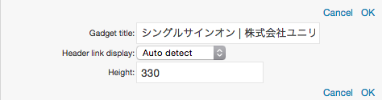

# MiniBrowser Gadget

MiniBrowser Gadget can be added on the Add Contents tab of the menu or the side menu.(Refer to [Register an Optional Web Site])

**Note:** The following image is appeared if Home Page of BeaconIT is set to MiniBrowser Gadget.

![MiniBrowser Gadget]

You can only customize to change the title and adjust the height of Gadget.  
Add a new MiniBrowser Gadget again from the content addition panel to display another Web Site.

## Description of Icons

<table>
    <thead>
        <tr>
            <th>Icon</th>
            <th>Name</th>
            <th>Description</th>
        </tr>
    </thead>
    <tbody>
	<tr>
    	<td></td>
        <td>Refresh</td>
    	<td>Reload a Web page. <strong>Note:</strong> Normally, MiniBrowser Gadgets are automatically updated according to the setting time of server.</td>
    </tr>
	<tr>
    	<td></td>
        <td>Minimize</td>
    	<td>Minimize gadgets. When a gadget is minimized, the icon is switched to  icon, which restore the gadget to the original size.</td>
    </tr>
	<tr>
    	<td></td>
        <td>Restore</td>
    	<td>Restore the minimized Gadget.</td>
    </tr>
	<tr>
    	<td></td>
        <td>Maximize</td>
    	<td>Maximize a Gadget. When maximizing a Gadget, the icon turns into Restore icon.</td>
    </tr>
	<tr>
    	<td></td>
        <td>Show Menu</td>
    	<td>Open the menu of Gadget.</td>
    </tr>
    </tbody>
</table>

## Description of the Menu

Menu of Gadget is opened if Show Menu(![Gadget Menu icon])icon is clicked.

![Description of the Menu]

<table>
    <thead>
        <tr>
            <th>Icon</th>
            <th>Name</th>
            <th>Description</th>
        </tr>
    </thead>
    <tbody>
	<tr>
    	<td></td>
    	<td>Edit</td>
        <td>The following gadget settings is displayed by clicking this icon.  
			<ul>
		    	<li>Header link display: Target of the title link of Gadget header is set. <b>Frame in portal</b> : Linked web site is displayed in the frame in portal. <b>New window</b> : Linked web site is displayed in the new window. <b>Auto detect</b> : Let the system to apply either of the above automatically.</li>
		    	<li>Height: Set the height of a Gadget. The height can be adjusted by drag-and-drop operation.</li>
		    </ul>
           	<b>CANCEL</b>: close the gadget settings without saving the setting. <b>OK</b>: save the setting and then close the gadget settings.
		</td>
    </tr>
	<tr>
    	<td></td>
    	<td>Delete</td>
        <td>Delete Gadget from personalized area.</td>
    </tr>
    </tbody>
</table>

## Adjusting Height

The mode to adjust the height of a Gadget is turned on if the mouse is put on the area under a Gadget.  
The height can be adjusted by drag-and-drop operation.

![Adjust the height]

[Register an Optional Web Site]: registering-an-optional-web-site.md
[MiniBrowser Gadget]: images/widget/minibrowser-gadget-1.png
[Description of the Menu]: images/widget/minibrowser-gadget-2.png
[Adjust the height]: images/widget/minibrowser-gadget-4.png
