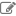

# Operations of a Tab

The screen can be switched by multiple tabs. This page explains operations of a tab.

## Tab Menu

Kinds of operations of the tab are executed from the tab menu.

The tab operations on the tab menu are different and they depend on the fixed tab and the user's adding tab.
* The operations on the tab menu of the user's adding tab are "Refresh", "Delete", "Rename", "Change the number of Columns", and "Reset Column Width".
* The operations on the tab menu of the fixed tab are "Refresh", "Change the number of Columns", "Reset Column Width", and "Initialize tab content".

### Opening the Tab Menu

The tab menu is displayed if the tab menu icon(![Gadget Menu icon]) on the right side of the tab name is clicked.

### Closing the Tab Menu

The tab menu is closed by clicking any place, except for the displayed tab menu and the tab menu icon(![Gadget Menu icon]).

### The Tab Menu Description

<table>
    <thead>
        <tr>
            <th>Icon</th><th>Label</th><th>Description</th>
        </tr>
    </thead>
    <tbody>
        <tr>
            <td></td>
            <td>Reload</td>
            <td>
                Reload all Gadgets that are set in the tab of the object. 
                The animation icon() to show the tab is reloading is displayed on the tab that is reloading. 
                <strong>Note:</strong> There are also cases that spend time on reloading according to the setting number and type of Gadgets.
            </td>
        </tr>
        <tr>
            <td></td>
            <td>Delete</td>
            <td>
                Delete the tab of the object. A confirmation message is displayed if the Delete menu is clicked. If Yes is selected, this tab is deleted from the personalized area. 
                Note that the information of all Gadgets that are set in the tab is lost if the tab is deleted.(Move to the Trash Bin)
                This menu is not displayed in the fixed tab.
            </td>
        </tr>
        <tr>
            <td></td>
            <td>Change name</td>
            <td>
                Change the number of columns of the specified tab. The name of the specified tab is changed by typing an optional name in the input box of the name change menu. 
                Maximum character length of the tab name is 80 characters. 
                The name typed in the input box is applied to the name of tab by one of the following operations: 
                - Press ENTER in the input box
                - Remove focus from the input box
                - Close the tab menu
                This menu is not displayed in the fixed tab.
            </td>
        </tr>
        <tr>
            <td></td>
            <td>Change number of columns</td>
            <td>
                Change the number of the tab. The number of the columns in the tab is changed by selecting the number of column between 1 and 10 in the list box of the column number change menu.
            </td>
        </tr>
        <tr>
            <td></td>
            <td>Adjust width of column</td>
            <td>
                Process the displaying width of columns of the tab to be equal. The displaying width of columns of the specified tab become equal by clicking the menu to process the width of columns to be equal.
            </td>
        </tr>
        <tr>
            <td></td>
            <td>Initialize the composition of a tab</td>
            <td>
                Initialize the target tab.The customization information of the target tab will be returned to an initial state. 
                <b>The gadgets that are set in the tab,the tab that are added,the Global Settings(General settings) will all be deleted.So please be careful when using it. </b> 
                The deleted gadgets will all moved in the Trash Bin.
            </td>
        </tr>
    </tbody>
</table>

### Reloading All Tabs

All Gadgets set on the all tabs are reloaded if (![Refresh icon])button is clicked.(The Gadgets that have not been displayed is executed the initial reloading).
![Reloading all tab]

Reload All Tabs (![Refresh icon])button is changed to Stop Reloading All Tabs(![Stop icon]) button if all tabs are being reloaded. 
Reloading all tabs is stopped if Stop Reloading All Tabs(![Stop icon]) button is clicked. Reloading of all gadgets that are not started to be reloaded is also not executed. 
Moreover, when all tabs are reloading, the progress bar is displayed at the bottom of the Portal screen to show the reloading progress status. The number on the left side of the slash in this bar is the number of Gadget that is finished reloading. The right side number is the total number of reloading Gadget.
![Progress bar]

## Adding a Tab

Click ![Add the tab] to add a new tab to the screen. A new tab is added.
![Adding the tab]

The maximum number of tabs that can be added depends on the system setting.

## Changing the Display Order of Tabs

Displaying tabs can be displayed in an optional order.
Drag the label of the tab of the object, and drop in a tab place where you want to display to change the display order of tabs.
![Changing the Display Order]

**Note:** Tabs that have been added at the Management Page(included **Home** tab) cannot move.

[Reloading all tab]: images/user-panel/operations-of-a-tab-1.png
[Add the tab]: images/user-panel/operations-of-a-tab-4.png
[Adding the tab]: images/user-panel/operations-of-a-tab-2.png
[Changing the Display Order]: images/user-panel/operations-of-a-tab-3.png
[Gadget Menu icon]: ../../images/show_hidden_icons.gif
[Progress bar]: ../../images/all_refresh_progress.png
[Refresh icon]: ../../images/refresh.gif
[Stop icon]: ../../images/stop.gif
