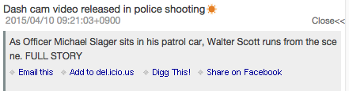
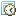

# RSS Reader Gadget

This page explains the controls and the operations of RSS Reader Gadget.

![RSS Reader Gadget]

<table>
    <thead>
        <tr>
            <th>No</th><th>Name</th><th>Description</th>
        </tr>
    </thead>
    <tbody>
        <tr>
            <td>(1)</td>
            <td>Title</td>
            <td>
                

                    The title of the Gadget. 
                    The concerned site is displayed by clicking the link that was set.
                

            </td>
        </tr>
        <tr>
            <td>(2)</td>
            <td>Icon</td>
            <td>
                

                    The control to execute functions of RSS Reader Gadget. 
                    Refer to the following table for the icon description.
                

            </td>
        </tr>
        <tr>
            <td>(3)</td>
            <td>RSS item title</td>
            <td>
                

                    The title of RSS item. 
                    The content of the corresponding site is displayed by clicking the link.
                

            </td>
        <tr>
        <tr>
            <td>(4)</td>
            <td>New arrival icon</td>
            <td>
                

                    Add to the updated RSS item within 1 business day(default). 
                    If it passes more than 1 business day from the last time closing infoScoop, the new arrival icons are added to RSS items that have been updated since the last closing time.
                

            </td>
        </tr>
        <tr>
            <td>(5)</td>
            <td>Date updated / Creator name</td>
            <td>
                

                    The date updated and the creator name(Only to be displayed if it has)of RSS items.
                

            </td>
        </tr>
        <tr>
            <td>(6)</td>
            <td>Details</td>
            <td>
                

                    The details of RSS item(the summary of content) are displayed by clicking the Details link. 
                     
                    The details are closed by clicking the <strong>Close</strong> link.
                

            </td>
        </tr>
    </tbody>
</table>

## Header Icon Descriptions

<table>
    <thead>
        <tr>
            <th>Icon</th><th>Name</th><th>Description</th>
        </tr>
    </thead>
    <tbody>
        <tr>
            <td></td>
            <td>Refresh</td>
            <td>
                

                    Reload a RSS. 
                    <strong>Note:</strong> Normally, RSS Reader Gadgets are automatically updated according to the setting time of server. 
                    The new arrival icon rotates to inform that the RSS item has been updated since the last display.
                

            </td>
        </tr>
        <tr>
            <td></td>
            <td>Minimize/ display number of new arrival items</td>
            <td>
                

                    When minimizing a Gadget, the icon turns into Restore icon. 
                    
                    When minimizing, the sun shaped icon is displayed and the number of new arrival items is displayed.
                

            </td>
        </tr>
        <tr>
            <td></td>
            <td>Display all new arrival RSS items</td>
            <td>
                

                    Display all the updated RSS items within 1 business day(default). 
                    New arrival icon displaying time can be changed in <a href="global-settings.md" title="Global Settings">Global Settings</a> page.
                

            </td>
        </tr>
        <tr>
            <td>
            <td>Restore</td>
            <td>
                

                    Restore the minimized Gadget.
                

            </td>
        </tr>
        <tr>
            <td></td>
            <td>Maximize</td>
            <td>
                

                    Maximize a Gadget. Refer to the following part for the description of the maximized RSS Reader Gadget.
                

            </td>
        </tr>
        <tr>
            <td></td>
            <td>Show Menu</td>
            <td>
                

                    Open the menu of Gadget.
                

            </td>
        </tr>
    </tbody>
</table>

## Description of the Menu

Menu of Gadget is opened if Show Menu(![Gadget Menu icon])icon is clicked.

![Show Gadget menu]

<table>
    <thead>
        <tr>
            <th>Icon</th><th>Name</th><th>Description</th>
        </tr>
    </thead>
    <tbody>
        <tr>
            <td></td>
            <td>Edit</td>
            <td>
                

                    The following gadget settings is displayed by clicking this icon. 
                     
                    <ul>
                        <li>Gadget title: Type title of Gadget.</li>
                        <li>Start a new line: select whether to start a new line to display titles or to hide the part that cannot be displayed in one line.</li>
                        <li>Display date: switch display or hide the date updated.</li>
                        <li>Change the number of the results to be displayed: the number of the results to be displayed can be select in pull-down list.</li>
                        <li>Scroll mode:
                            <ul>
                                <li>Scroll: make the scroll function valid.</li>
                                <li>None: make the scroll function invalid.</li>
                            </ul>
                        </li>
                        <li>Detail display mode: set the display methods for details.
                            <ul>
                                <li>Inline: display details under the selected item in RSS Reader Gadget.</li>
                                <li>Popup: display details in the popup window for displaying details.</li>
                            </ul>
                        </li>
                        <li>Content display mode: set a target when clicking a link of RSS item.
                            <ul>
                                <li>Frame in portal: display the linked web site in a frame in portal.</li>
                                <li>New window: display the linked web site in a new window.</li>
                                <li>Auto detect: let the system to apply either of the above automatically.</li>
                            </ul>
                        </li>
                        <li>icon: Display the source of RSS. Use it if getting URL of RSS.</li>
                    </ul>
                    <strong>CANCEL:</strong> close the gadget settings without saving the setting. 
                    <strong>OK:</strong> save the setting and then close the gadget settings.
                

            </td>
        </tr>
        <tr>
            <td></td>
            <td>Decrease the number of displayed items</td>
            <td>
                
Decrease displayed RSS item by one.

            </td>
        </tr>
        <tr>
            <td></td>
            <td>Increase the number of displayed items</td>
            <td>
                
Increase displayed RSS item by one.

            </td>
        </tr>
        <tr>
            <td></td>
            <td>Access statistics</td>
            <td>
                
Display the access statistic information of RSS. Refer to <a href="access-statistics.md" title="Access statistics">Access statistics</a> for the access statistic description.

            </td>
        </tr>
        <tr>
            <td></td>
            <td>Search</td>
            <td>
                

                    Display a search box to search in the site. 
                    Click any place except for the search box to close search box. 
                    Searching in the site function can be used if it is valid in the system setting.
                

            </td>
        </tr>
        <tr>
            <td></td>
            <td>Display/Hide the detail date</td>
            <td>
                
Switch display or hide the date updated.

            </td>
        </tr>
        <tr>
            <td></td>
            <td>Line breaks</td>
            <td>
                
Displaying the title of RSS item with a new line or Hiding the part that cannot be displayed in a line is able to be selected.

            </td>
        </tr>
        <tr>
            <td></td>
            <td>Delete</td>
            <td>
                
Delete Gadget from personalized area.

            </td>
        </tr>
    </tbody>
</table>

## Maximizing RSS Reader Gadget

A maximized RSS Reader Gadget is displayed by clicking "Maximize" icon in the Gadget header.

![Maximizing RSS Reader Gadget]

<table>
    <thead>
        <tr>
            <th>No</th><th>Name</th><th>Description</th>
        </tr>
    </thead>
    <tbody>
        <tr>
            <td>(1)</td>
            <td>RSS icon list</td>
            <td>
                
The details are displayed by clicking a RSS link.

            </td>
        </tr>
        <tr>
            <td>(2)</td>
            <td>Focused settings</td>
            <td>
                

                    <ul>
                        <li>Title: search and display as title.</li>
                        <li>Author: search and display as the author.</li>
                        <li>Date: search and display as a period of time.</li>
                        <li>Category: search and display as category.</li>
                    </ul>
                

            </td>
        </tr>
        <tr>
            <td>(3)</td>
            <td>Icon</td>
            <td>
                

                    The control to execute functions of the maximized RSS Reader. 
                    Refer to the following table for icons.
                

            </td>
        </tr>
        <tr>
            <td>(4)</td>
            <td>RSS item detail/ Content display area</td>
            <td>
                
Display the content of selected rss item.When display mode is "Summary display", display summary in rss item.When display mode is "Full display", display the content linked rss item.

            </td>
        </tr>
        <tr>
            <td>(5)</td>
            <td>Width change area</td>
            <td>
                
The width of RSS item list can be changed by drag-and-drop operation of this area

            </td>
        </tr>
        <tr>
            <td>(6)</td>
            <td>Send mail</td>
            <td>
                
Send mail titled RSS item title.

            </td>
        </tr>
        <tr>
            <td>(7)</td>
            <td>Send message</td>
            <td>
                
Send message titled RSS item title.

            </td>
        </tr>
    </tbody>
</table>

## Description of the Maximized Header Icons

<table>
	<tr>
    	<th>Icon</th>
        <th>Name</th>
        <th>Description</th>
    </tr>
	<tr>
    	<td></td>
        <td>Full display</td>
        <td>Switch the detail display panel on the right at the mode in which the whole content is displayed in the inner frame.</td>
    </tr>
	<tr>
    	<td></td>
        <td>Summary display</td>
        <td>Switch the detail display panel on the right at the mode in which the summary of rss item is displayed.</td>
    </tr>
	<tr>
    	<td></td>
        <td>Display/Hide the detail date</td>
        <td>Switch display or hide the date updated.</td>
    </tr>
	<tr>
    	<td></td>
        <td>Refresh</td>
        <td>Reload a RSS.</td>
    </tr>
	<tr>
    	<td></td>
        <td>Help</td>
        <td>Display the help window.</td>
    </tr>
	<tr>
    	<td></td>
        <td>Back</td>
        <td>Restore the maximized window.</td>
    </tr>
</table>

## Details Displayed When Maximized

There are 2 patterns of displaying the details of the contents when RSS Reader Gadget is maximized.

1. With ![Summary display icon], click RSS item.
   The summary information of the selected RSS item is displayed in the inner frame.
   ![Summary display]

2. With ![Full display icon], click RSS item.
   The content of the selected RSS item is displayed in the inner frame.
   ![Full display]

## Keyboard Operations

You can operate RSS Reader Gadget from the keyboard below.

<table>
	<tr>
    	<th>Key</th>
        <th>Description</th>
    </tr>
	<tr>
        <td>UP ARROW, DOWN ARROW</td>
        <td>Move in the content part.</td>
    </tr>
	<tr>
        <td>LEFT ARROW, RIGHT ARROW</td>
        <td>Replace summary display or full display(similar to  / )</td>
    </tr>
	<tr>
        <td>ENTER</td>
        <td>Summary display or full display the selected content.</td>
    </tr>
	<tr>
        <td>SHIFT+M</td>
        <td>Send mail</td>
    </tr>
	<tr>
        <td>R</td>
        <td>Refresh(similar to )</td>
    </tr>
	<tr>
        <td>Q</td>
        <td>Restore(remove "maximize")(similar to )</td>
    </tr>
	<tr>
        <td>T</td>
        <td>Display/Hide the detail date time(similar to )</td>
    </tr>
	<tr>
        <td>M</td>
        <td>Replace summary diplay/full display(similar to  / )</td>
    </tr>
	<tr>
        <td>H</td>
        <td>Display the Help(similar to )</td>
    </tr>
</table>

[RSS Reader Gadget]: images/widget/rss-reader-gadget-1.png
[Show Gadget menu]: images/widget/rss-reader-gadget-4.png
[Maximizing RSS Reader Gadget]: images/widget/rss-reader-gadget-6.png
[Summary display]: images/widget/rss-reader-gadget-7.png
[Full display]: images/widget/rss-reader-gadget-8.png
[Full display icon]: ../../images/html_valid.png
[Gadget Menu icon]: ../../images/show_hidden_icons.gif
[Summary display icon]: ../../images/html_gray.png
