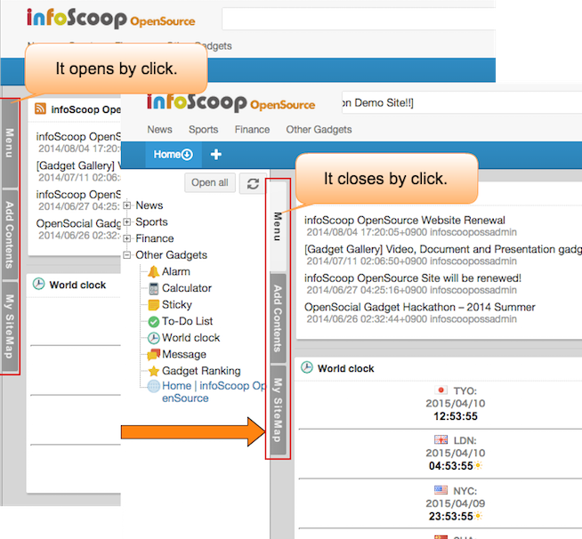

# Screen Layout

This page explains the screen layout of infoScoop.

## Descriptions of Panels

infoScoop consists of the following panels.

 ![Descriptions of Panels]

<table>
    <thead>
        <tr>
            <th>No</th><th>Name</th><th>Description</th>
        </tr>
    </thead>
    <tbody>
        <tr>
            <td>(1)</td>
            <td>Command bar</td>
            <td>Region that includes the logo, the name, the search column of the site. The following components can be arranged on the command bar. 
                <ul>
                    <li>Ticker(an electrical bulletin board) gadget(optional)</li>
                    <li>Changing the character size icon(optional)</li>
                    <li>Ranking(optional)</li>
                    <li>Trash Bin(optional)</li>
                    <li>Global settings(optional)</li>
                    <li>The list of Gadget authentication information(optional)</li>
                    <li>Search form(optional)</li>
                    <li>Message console(essential)</li>
                    <li>URL link(optional)</li>
                </ul>
            </td>
        </tr>
        <tr>
            <td>(2)</td>
            <td>Menu</td>
            <td>Menus that the system provides all users with. The list of site links is displayed on the menu. RSS icon is also displayed if the site provides RSS feed. Gadget can be added to the personalized area by drag-and-drop operation of the corresponding icon that is displayed if the Gadget is registered besides RSS.</td>
        </tr>
        <tr>
            <td>(3)</td>
            <td>Side panel</td>
            <td><b>Site Map</b>: is an overview that shows all items on the menu by a tree-like structure. The function is similar to the function of the Menu. <b>Content addition</b>: supplies with the control to add RSS, Web Site that is not on the menu. The side panel is opened by clicking the tab.The width of the side panel can be adjusted by drag-and-drop operation if the side panel is opened. The adjusted width is not saved.</td>
        </tr>
        <tr>
            <td>(4)</td>
            <td>Tab</td>
            <td>Multiple tabs can be arranged in a browser. Optional gadgets can be arranged on each tab.</td>
        </tr>
        <tr>
            <td>(5)</td>
            <td>Fixed area</td>
            <td>Information column that the system supplies all users in common. Users cannot add a gadget(the rectangle region that shows various information) to this area, and also cannot move the displaying gadget.</td>
        </tr>
        <tr>
            <td>(6)</td>
            <td>Personalized area</td>
            <td>Region in which every user can arrange gadgets optionally. RSS information is arranged from the menu or the site map if necessary.</td>
        </tr>
    </tbody>
</table>

**Note**: The displayed components change according to the server setting. Normally, all the above-mentioned components are not displayed at the same time.

## Gadget

In infoScoop, the rectangle shape components that are arranged on the screen(the command bar, the fixed area, and the personalized area) is called Gadget.

There are many types of gadgets, a typical one is RSS Gadget which displays RSS.  
An example of Gadget(multi-RSS Gadget) is below:

![RSS Gadget]

[Descriptions of Panels]: images/layout/screen-layout-1.png
[RSS Gadget]: images/layout/screen-layout-4.png
