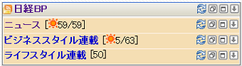
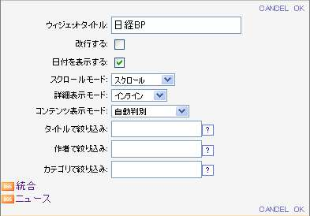

# まとめてRSSリーダー

まとめてRSSリーダーは、複数のRSSリーダーをまとめて表示するためのガジェットです。

この節ではまとめてRSSリーダーのコントロールとその操作について説明します。  
RSSリーダーと機能が重複する部分については説明を省略していますので[RSSリーダー][RSS Reader Gadget]のページも参照ください。

![まとめてRSSリーダー][Composite RSS Reader Gadget]

<table>
    <thead>
        <tr>
            <th>番号</th><th>名前</th><th>説明</th>
        </tr>
    </thead>
    <tbody>
        <tr>
            <td>(1)</td>
            <td>タイトル</td>
            <td>
                

                    ガジェットのタイトルです。 
                    リンクが設定されている場合、クリックすると設定されたサイトを表示します。
                

            </td>
        </tr>
        <tr>
            <td>(2)</td>
            <td>アイコン</td>
            <td>
                

                    まとめてRSSリーダーの各機能を実行するアイコンです。 
                    各アイコンの説明は以下の表を参照。
                

            </td>
        </tr>
        <tr>
            <td>(3)</td>
            <td>カテゴリ別タイトル</td>
            <td>
                

                    まとめてRSSリーダー内に表示される各カテゴリのタイトルが表示されます。 
                    リンクが設定されている場合、クリックすると設定されたサイトを表示します。
                

            </td>
        </tr>
        <tr>
            <td>(4)</td>
            <td>カテゴリ別アイコン</td>
            <td>
                

                    まとめてRSSリーダーは、ガジェットのタイトルバーと各カテゴリのタイトルバーにそれぞれアイコンが用意されています。 
                    タイトルバー上のアイコンはまとめてRSSリーダー上の全てのカテゴリに対して操作が行われ、カテゴリのタイトルバー上のアイコンは各カテゴリに対しての操作になります。
                

            </td>
        </tr>
    </tbody>
</table>

## ヘッダアイコンの説明

<table>
    <thead>
        <tr>
            <th>アイコン</th><th>名前</th><th>説明</th>
        </tr>
    </thead>
    <tbody>
        <tr>
            <td></td>
            <td>更新</td>
            <td>
                

                    RSSを再読み込みします。 
                    <b>注意</b> 各RSSリーダーは通常、サーバーで設定された間隔で自動的に更新が行われます。 
                    前回の表示以降に更新されたRSSアイテムに付けられる新着アイコンは回転し情報が新しい事を知らせます。
                

            </td>
        </tr>
        <tr>
            <td></td>
            <td>最小化/新着件数表示</td>
            <td>
                

                    ガジェットを最小化します。「最小化」アイコンは「元に戻す」アイコンに替わります。 
                    最小化すると太陽アイコンが表示され、新着RSSアイテムの件数が表示されます。 
                    RSSアイテムの件数は、新着件数/総件数の順で表示されます。 
                    
                

            </td>
        </tr>
        <tr>
            <td></td>
            <td>元に戻す</td>
            <td>
                
最小化されているガジェットを元に戻します。

            </td>
        </tr>
        <tr>
            <td></td>
            <td>最大化</td>
            <td>
                
ガジェットを最大化します。最大化されたまとめてRSSリーダーの説明は次節を参照してください。

            </td>
        </tr>
        <tr>
            <td></td>
            <td>メニューを開く</td>
            <td>
                
ガジェットのメニューを開きます。

            </td>
        </tr>
    </tbody>
</table>

## メニューの説明

メニューを開くアイコン![ガジェットメニュー表示アイコン][Gadget Menu icon]をクリックすると、ガジェットのメニューが開きます。

![まとめてRSSリーダーのガジェットメニュー][Gadget menu]

<table>
    <thead>
        <tr>
            <th>アイコン</th><th>名前</th><th>説明</th>
        </tr>
    </thead>
    <tbody>
        <tr>
            <td></td>
            <td>設定</td>
            <td>
                

                    クリックするとガジェット設定が表示されます。 
                     
                    <ul>
                        <li>ガジェットタイトル: 任意のガジェットタイトルを挿入します。</li>
                        <li>改行する: RSSアイテムのタイトルを改行して表示するか、一行で表示できない部分を隠すかどうかを選択します。</li>
                        <li>日付を表示する: 更新日時の表示/非表示を切り替えます。</li>
                        <li>スクロールモード:
                            <ul>
                                <li>スクロール: スクロール機能を有効にします。</li>
                                <li>スクロールなし: スクロール機能を無効にします。</li>
                            </ul>
                        </li>
                        <li>詳細表示モード: 詳細の表示方法を設定します。
                            <ui>
                                <li>インライン: RSSリーダー内の選択したアイテムの下に詳細を表示します。</li>
                                <li>ポップアップ: 詳細を詳細表示用のポップアップウィンドウに表示します。</li>
                            </ul>
                        </li>
                        <li>コンテンツ表示モード: RSSアイテムのリンクをクリックした場合の表示先を設定します。
                            <ul>
                                <li>ポータル内フレーム: ポータル内フレームにリンク先を表示します。</li>
                                <li>新しいウィンドウ: 新しいウィンドウにリンク先を表示します。</li>
                                <li>自動判別: 上記のどちらかについて、システム設定が適用されます。</li>
                            </ul>
                        </li>
                        <li>
                            タイトルで絞り込み: タイトルが指定した条件に合致するRSSアイテムのみが表示されます。 
                            ただし、この設定は時間順表示のときのみ使用されます。 
                            以下の記述が使用できます。
                                <ul>
                                    <li>AND検索: 「A B」(AおよびBを含む)</li>
                                    <li>OR検索: 「A OR B」(AまたはBを含む)</li>
                                    <li>NOT検索: 「-A」(Aを含まない)</li>
                                </ul>
                            使用例: (東京 OR 大阪) ニュース -社会
                        </li>
                        <li>
                            作者で絞り込み: 作者名が指定した文字列で始まるRSSアイテムのみが表示されます。 
                            ただし、この設定は時間順表示のときのみ使用されます。
                        </li>
                        <li>
                            カテゴリで絞り込み: カテゴリが指定した文字列と完全一致するRSSアイテムのみが表示されます。 
                            ただし、この設定は時間順表示のときのみ使用されます。
                        </li>
                        <li>アイコン: RSSのソースを表示します。RSSのURLを取得するときなどに使用して下さい。</li>
                    </ul>
                    [CANCEL]: 設定を保存せずにガジェット設定を閉じます。 
                    [OK]: 設定を保存しガジェット設定を閉じます。
                

            </td>
        </tr>
        <tr>
            <td></td>
            <td>表示件数を減らす</td>
            <td>
                
表示するRSSアイテムの件数を1件減らします。

            </td>
        </tr>
        <tr>
            <td></td>
            <td>表示件数を増やす</td>
            <td>
                
表示するRSSアイテムの件数を1件増やします。

            </td>
        </tr>
        <tr>
            <td></td>
            <td>時間順表示</td>
            <td>
                

                    全てのカテゴリを統合し、時間順表示に切り替えます。 
                    ただし、不正な日付フォーマットのアイテムが含まれている場合は正しく時間順でソートできません。
                

            </td>
        </tr>
        <tr>
            <td></td>
            <td>検索</td>
            <td>
                

                    検索ボックスにキーワードを入力して、実行ボタンをクリック、またはEnterキーを押すことでサイト内検索を行います。 
                    サイト内検索は、システム設定により有効になっている場合のみ利用できます。
                

            </td>
        </tr>
        <tr>
            <td></td>
            <td>詳細日時表示/非表示</td>
            <td>
                
更新日時の表示/非表示を切り替えます。

            </td>
        </tr>
        <tr>
            <td></td>
            <td>改行有無</td>
            <td>
                
RSSアイテムのタイトルを改行して表示するか、一行で表示できない部分を隠すかどうかを選択します。

            </td>
        </tr>
        <tr>
            <td></td>
            <td>削除</td>
            <td>
                
パーソナライズエリアからガジェットが削除されます。

            </td>
        </tr>
    </tbody>
</table>

## まとめてRSSリーダーの最大化

ガジェットヘッダの最大化アイコンをクリックすると、最大化されたまとめてRSSリーダーを表示します。

![最大化されたまとめてRSSリーダー][Maximizing Composite RSS Reader Gadget]

RSSアイテムは設定により、登録されているカテゴリ別または全てまとめて表示されます。それ以外の操作についてはRSSリーダーの最大化と同じです。最大化時の操作については、ユーザーガイドの<a href="rss-reader-gadget.md#maximize">RSSリーダーの最大化</a>を参照ください。

## カテゴリ別表示、統合(時間順)表示の切り替え

まとめてRSSリーダーがカテゴリ別に表示されている際にアイコンをクリックすると、全カテゴリを統合し、時間順にRSSアイテムを表示します。

統合表示の際にアイコンをクリックするとカテゴリ別にRSSアイコンが表示されます。

![カテゴリ表示時のガジェットメニュー][Display According to Category]

カテゴリ表示時、表示されるアイコンは時間順表示への切り替えアイコンの![時間順表示アイコン][Display According]が表示されます。

![時間順表示時のガジェットメニュー][Display According to Time Order]

統合(時間順)表示時、カテゴリ表示への切り替えアイコンの![カテゴリ別表示アイコン][Display According]が表示されます。

## RSSリーダーのマージ

メニューまたはガジェットをドラッグし、RSSリーダーまたはまとめてRSSリーダーへドロップすると、マージ確認ダイアログが表示されます。

![マージ確認ダイアログの表示][Merge confirm dialog]

[マージしない]をクリックすると、ドラッグ前の状態に戻ります。  
[マージする]をクリックすると、まとめてRSSリーダーに追加または新たにまとめてRSSリーダーが生成されます。

![マージ結果][After merged]

[RSS Reader Gadget]: rss-reader-gadget.md "RSSリーダー"
[Composite RSS Reader Gadget]: images/widget/composite-rss-reader-gadget-1.png "まとめてRSSリーダー"
[Gadget menu]: images/widget/composite-rss-reader-gadget-3.png "まとめてRSSリーダーのガジェットメニュー"
[Maximizing Composite RSS Reader Gadget]: images/widget/composite-rss-reader-gadget-5.png "最大化されたまとめてRSSリーダー"
[Display According to Category]: images/widget/composite-rss-reader-gadget-6.png "カテゴリ表示時のガジェットメニュー"
[Display According to Time Order]: images/widget/composite-rss-reader-gadget-7.png "時間順表示時のガジェットメニュー"
[Merge confirm dialog]: images/widget/composite-rss-reader-gadget-8.png "マージ確認ダイアログの表示"
[After merged]: images/widget/composite-rss-reader-gadget-9.png "マージ結果"
[Display According]: ../../images/display_sort.gif "ソート表示アイコン"
[Gadget Menu icon]: ../../images/show_hidden_icons.gif "ガジェットメニュー表示アイコン"
