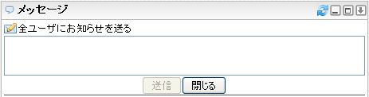

# メッセージ

メッセージガジェットのコントロールとその操作について説明します。

![メッセージガジェット][message_gadget_jp]

<table>
    <thead>
        <tr>
            <th>番号</th><th>名前</th><th>説明</th>
        </tr>
    </thead>
    <tbody>
        <tr>
            <td>(1)</td>
            <td>タイトル</td>
            <td>
                

                    ガジェットのタイトルです。 
                    リンクが張られている場合、クリックすると当該サイトのコンテンツを表示します。
                

            </td>
        </tr>
        <tr>
            <td>(2)</td>
            <td>ヘッダアイコン</td>
            <td>
                

                    メッセージの各機能を実行するコントロール。 
                    各アイコンの説明は後述の表を参照。
                

            </td>
        </tr>
        <tr>
            <td>(3)</td>
            <td>公開メッセージ</td>
            <td>
                

                    クリックすると公開メッセージ入力フォームを表示します。 
                    
                

            </td>
        </tr>
        <tr>
            <td>(4)</td>
            <td>システムグループ</td>
            <td>
                

                    <ul>
                        <li>
                            受信メッセージ 
                            アイコンをクリックすると、自身宛てのメッセージを表示するRSSリーダーが追加されます。
                        </li>
                        <li>
                            送信メッセージ 
                            アイコンをクリックすると、自身が送信した公開メッセージ、メッセージを表示するRSSリーダーが追加されます。
                        </li>
                        <li>
                            お知らせ 
                            アイコンをクリックすると、お知らせ送信されたメッセージを表示するRSSリーダーが追加されます。 
                            アイコンをクリックすると、全ユーザー宛てのメッセージを送信するフォームが表示されます。 
                            このアイコンは、システム設定で許可されていない場合は表示されません。 
                            
                        </li>
                        <li>
                            全ユーザーの公開メッセージ 
                            アイコンをクリックすると、全ユーザーの公開メッセージおよび自身宛てのメッセージを表示するRSSリーダーが追加されます。
                        </li>
                    </ul>
                

            </td>
        </tr>
        <tr>
            <td>(5)</td>
            <td>ユーザーグループヘッダ</td>
            <td>
                

                    ユーザーグループ名称が表示されます。 
                    グループ名称右のアイコンをクリックすると、ユーザーグループに所属する全てのユーザーの送信した公開メッセージおよび自身宛てのメッセージを表示するRSSリーダーが追加されます。 
                    アイコンをクリックすると、ユーザーグループに所属する全てのメンバー宛てのメッセージを送信するフォームが表示されます。 
                    
                

            </td>
        </tr>
        <tr>
            <td>(6)</td>
            <td>ユーザーグループ</td>
            <td>
                

                    作成したユーザーグループに所属するユーザーの一覧が表示されます。 
                    ユーザー名右のアイコンをクリックすると、対象ユーザーの送信した公開メッセージおよび自身宛てのメッセージを表示するRSSリーダーが追加されます。 
                    アイコンをクリックすると、対象ユーザー宛てのメッセージを送信するフォームが表示されます。
                

            </td>
        </tr>
    </tbody>
</table>

## ヘッダアイコンの説明

<table>
    <thead>
        <tr>
            <th>アイコン</th><th>名前</th><th>説明</th>
        </tr>
    </thead>
    <tbody>
        <tr>
            <td></td>
            <td>更新</td>
            <td>
                

                    新着メッセージのチェックを行います。 
                    通常はガジェットの自動更新間隔(システム設定: デフォルト10分)でチェックが行われます。手動でチェックを行いたい場合はこのアイコンをクリックします。
                

            </td>
        </tr>
        <tr>
            <td></td>
            <td>最小化</td>
            <td>
                
ガジェットを最小化します。最小化されているガジェットは、このアイコンが[元に戻す]アイコンに切り替わるので、これをクリックすることで元のサイズに戻ります。

            </td>
        </tr>
        <tr>
            <td></td>
            <td>元に戻す</td>
            <td>
                
最小化されているガジェットを元に戻します。

            </td>
        </tr>
        <tr>
            <td></td>
            <td>最大化</td>
            <td>
                
ガジェットを最大化します。最大化されたメッセージガジェットの説明は後述を参照してください。

            </td>
        </tr>
        <tr>
            <td></td>
            <td>メニューを開く</td>
            <td>
                
ガジェットのメニューを開きます。

            </td>
        </tr>
    </tbody>
</table>

## メニューの説明

メニューを開くアイコン![ガジェットメニュー表示アイコン][Gadget Menu icon]をクリックすると、ガジェットのメニューが開きます。

<table>
	<tr>
        <th>アイコン</th>
        <th>名前</th>
        <th>説明</th>
    </tr>
	<tr>
    	<td></td>
    	<td>グループ編集</td>
        <td>グループ編集ウィンドウを表示します。グループ編集ウィンドウの説明は後述を参照してください。</td>
    </tr>
	<tr>
    	<td></td>
    	<td>削除</td>
        <td>パーソナライズエリアからガジェットが削除されます。</td>
    </tr>
</table>

## メッセージガジェットの最大化

ガジェットヘッダの最大化アイコンをクリックすると、最大化されたメッセージガジェットを表示します。

![最大化されたメッセージガジェット][message_gadget_maximize_jp]

<table>
    <thead>
        <tr>
            <th>番号</th><th>名前</th><th>説明</th>
        </tr>
    </thead>
    <tbody>
        <tr>
            <td>(1)</td>
            <td>ヘッダアイコン</td>
            <td>
                

                    最大化されたメッセージガジェットの機能を実行するコントロール。 
                    各アイコンの説明は後述の表を参照。
                

            </td>
        </tr>
        <tr>
            <td>(2)</td>
            <td>公開メッセージ</td>
            <td>	
                
クリックすると公開メッセージ入力フォームを表示します。

            </td>
        </tr>
        <tr>
            <td>(3)</td>
            <td>システムグループ</td>
            <td>
                

                    <ul>
                        <li>
                            受信メッセージ 
                            クリックすると、メッセージ表示ペインに自身宛てのメッセージが表示されます。
                        </li>
                        <li>
                            送信メッセージ 
                            クリックすると、メッセージ表示ペインに自身が送信したメッセージ(公開メッセージを含む)が表示されます。
                        </li>
                        <li>
                            お知らせ 
                            クリックすると、メッセージ表示ペインにお知らせ送信されたメッセージが表示されます。
                        </li>
                        <li>
                            全ユーザーの公開メッセージ 
                            クリックすると、メッセージ表示ペインに全ユーザーの公開メッセージおよび自身宛てのメッセージが表示されます。
                        </li>
                    </ul>
                

            </td>
        </tr>
        <tr>
            <td>(4)</td>
            <td>ユーザーグループヘッダ</td>
            <td>
                

                    ユーザーグループ名称が表示されます。 
                    ユーザーグループ名称をクリックすると、メッセージ表示ペインにそのユーザーグループに所属する全てのユーザーの送信した公開メッセージおよび自身宛てのメッセージが表示されます。 
                    アイコンをクリックすると、ユーザーグループに所属する全てのメンバー宛てのメッセージを送信するフォームが表示されます。
                

            </td>
        </tr>
        <tr>
            <td>(5)</td>
            <td>ユーザーグループ</td>
            <td>
                

                    作成したユーザーグループに所属するユーザーの一覧が表示されます。 
                    ユーザー名称をクリックすると、メッセージ表示ペインに対象ユーザーの送信した公開メッセージおよび自身宛てのメッセージが表示されます。 
                    アイコンをクリックすると、対象ユーザー宛てのメッセージを送信するフォームが表示されます。
                

            </td>
        </tr>
        <tr>
            <td>(6)</td>
            <td>メッセージ表示ペイン</td>
            <td>
                

                    選択されたメッセージの一覧が表示されます。 
                     
                    <ul>
                        <li>
                            ユーザー名称 
                            クリックすると、⑤のユーザー名称クリック時と同様の動作をします。
                        </li>
                        <li>
                            返信する 
                            クリックすると、メッセージ発信者宛てのメッセージを送信するフォームが表示されます。
                        </li>
                    </ul>
                

            </td>
        </tr>
    </tbody>
</table>

## 最大化時のヘッダアイコンの説明

<table>
    <thead>
        <tr>
            <th>アイコン</th><th>名前</th><th>説明</th>
        </tr>
    </thead>
    <tbody>
        <tr>
            <td></td>
            <td>更新</td>
            <td>
                

                    新着メッセージのチェックを行います。 
                    通常はガジェットの自動更新間隔(システム設定: デフォルト10分)でチェックが行われます。手動でチェックを行いたい場合はこのアイコンをクリックします。
                

            </td>
        </tr>
        <tr>
            <td></td>
            <td>グループ編集</td>
            <td>
                
グループ編集ウィンドウを表示します。グループ編集ウィンドウの説明は後述を参照してください。

            </td>
        </tr>
        <tr>
            <td></td>
            <td>元に戻す</td>
            <td>
                
最大化されているガジェットを元に戻します。

            </td>
        </tr>
    </tbody>
</table>

## グループ編集ウィンドウ

システム管理者がユーザー検索設定を行っている場合、ユーザーを検索して自身の作成したグループに追加することができます。

![グループ編集ウィンドウ(ユーザー検索有り)][message_gadget_groupmodal_search_jp]

システム管理者がユーザー検索設定を行っていない場合、以下のような画面が表示され、ユーザーIDを指定して自身の作成したグループに追加することができます。

![グループ編集ウィンドウ(ユーザー検索無し)][message_gadget_nosearch]

<table>
    <thead>
        <tr>
            <th>番号</th><th>名前</th><th>説明</th>
        </tr>
    </thead>
    <tbody>
        <tr>
            <td>(1)</td>
            <td>グループタブ</td>
            <td>
                

                    登録したグループの名称が表示されます。 
                    をクリックすると、グループ名称の変更を行うことができます。 
                    アイコンをクリックすると、グループを削除します。
                

            </td>
        </tr>
        <tr>
            <td>(2)</td>
            <td>グループ追加</td>
            <td>
                
クリックすると、グループを追加登録することができます。

            </td>
        </tr>
        <tr>
            <td>(3)</td>
            <td>ユーザー表示ペイン</td>
            <td>
                

                    グループに所属しているユーザー情報が以下のフォーマットで表示されます。 
                    <code>[ユーザー名称]([ユーザーID]) [メールアドレス] [組織名]</code> 
                    アイコンをクリックすると、グループからユーザーを削除します。
                

            </td>
        </tr>
        <tr>
            <td>(4)</td>
            <td>検索フォーム</td>
            <td>
                

                    ユーザー名、メールアドレス、所属組織を条件にしてグループに追加するユーザーを検索することができます。 
                    条件を入力し、検索ボタンをクリックすると入力条件で中間一致検索を行い、以下のように検索結果が表示されます。 
                     
                    検索結果のユーザー名左のチェックボックスにチェックを入れ、ユーザー追加ボタンをクリックすることで選択中のグループにユーザーを追加することができます。
                

            </td>
        </tr>
        <tr>
            <td>(5)</td>
            <td>閉じる</td>
            <td>
                
グループ編集ウィンドウを閉じます。

            </td>
        </tr>
        <tr>
            <td>(6)</td>
            <td>ユーザー追加フォーム</td>
            <td>
                
ユーザーIDを入力してユーザー追加ボタンをクリックすると、選択中のグループにユーザーを追加することができます。

            </td>
        </tr>
    </tbody>
</table>

## 新着メッセージチェック

ガジェットの自動更新間隔(システム設定: デフォルト10分)によりメッセージガジェットが更新された、または![更新アイコン][Refresh icon]アイコンによる手動更新が行われた場合、infoScoopのヘッダに通知メッセージが表示されます。  
ただし、若干のタイムラグがある場合があります。

![新着メッセージ通知][message_gadget_notice_jp]

通知「新着メッセージが届いています。」をクリックすると、メッセージガジェットが最大化状態で表示されます。

[message_gadget_jp]: images/widget/message-gadget-1.jpg "メッセージガジェット"
[message_gadget_maximize_jp]: images/widget/message-gadget-5.jpg "最大化されたメッセージガジェット"
[message_gadget_groupmodal_search_jp]: images/widget/message-gadget-7.jpg "グループ編集モーダル(ユーザー検索有り)"
[message_gadget_nosearch]: images/widget/message-gadget-8.png "グループ編集モーダル(ユーザー検索無し)"
[message_gadget_notice_jp]: images/widget/message-gadget-10.jpg "新着メッセージ通知"
[Gadget Menu icon]: ../../images/show_hidden_icons.gif
[Refresh icon]: ../../images/refresh.gif "更新アイコン"
