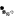
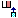
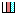

# タブの操作

画面は複数のタブによる切り替え表示が可能です。この節ではタブの操作について説明します。

## タブメニュー

タブの各種操作はタブメニューより行います。

タブメニューで行えるタブ操作は固定タブかユーザー追加タブかによって異なります。

* ユーザー追加タブのタブメニューで行える操作は「再読み込み」、「削除」、「名称変更」、「列数変更」、「列の幅を揃える」です。
* 固定タブのタブメニューで行える操作は「再読み込み」、「列数変更」、「列の幅を揃える」、「タブの構成を初期化する」です。

### タブメニューを開く

タブ名の右に表示されているタブメニューアイコン![タブメニュー表示アイコン][Gadget Menu icon]をクリックすると、タブメニューが表示されます。

### タブメニューを閉じる

表示されているタブメニューとタブメニューアイコン![タブメニュー表示アイコン][Gadget Menu icon]以外の場所をクリックするとタブメニューが閉じられます。

### タブメニューの説明

<table>
    <thead>
        <tr>
            <th>アイコン</th><th>ラベル</th><th>説明</th>
        </tr>
    </thead>
    <tbody>
        <tr>
            <td></td>
            <td>再読み込み</td>
            <td>
                対象のタブに設置された全てのガジェットを再読み込みします。 
                再読み込みを行っているタブには再読み込み中であることを示すアニメーションアイコンが表示されます。 
                <strong>注意</strong> 設置されているガジェットの数や種類によって再読み込みに時間がかかる場合があります。
            </td>
        </tr>
        <tr>
            <td></td>
            <td>削除</td>
            <td>
                対象のタブを削除します。削除メニューをクリックすると確認メッセージが表示され、「はい」を選択するとタブが画面から削除されます。 
                タブの削除を行う場合、タブ内に配置されているすべてのガジェットの情報が失われますのでご注意ください。(ごみ箱に入ります。)
                固定タブではこのメニューは表示されません。
            </td>
        </tr>
        <tr>
            <td></td>
            <td>名称変更</td>
            <td>
                対象のタブの名称を変更します。名称変更メニューの入力ボックスに任意の名称を入力することで対象のタブの名称が変更されます。 
                タブの名称は最大80文字まで設定可能です。 
                入力ボックスでエンターキーを押す、入力ボックスからフォーカスを外す、タブメニューを閉じる、のいずれかの操作を行うことで事で入力ボックスに入力された名称がタブ名に反映されます。
                固定タブではこのメニューは表示されません。
            </td>
        </tr>
        <tr>
            <td></td>
            <td>列数変更</td>
            <td>
                対象のタブの列数を変更します。列数変更メニューのリストボックスで1~10の範囲で列数を選択することで対象のタブの列数が変更されます。
            </td>
        </tr>
        <tr>
            <td></td>
            <td>列の幅を揃える</td>
            <td>
                対象のタブの列の表示幅を均等にします。列の幅を均等にするメニューをクリックすると、対象のタブの各列の表示幅が均等になります。
            </td>
        </tr>
        <tr>
            <td></td>
            <td>タブの構成を初期化する</td>
            <td>
                対象のタブを初期化します。対象のタブに関する自身のカスタマイズ情報を初期状態に戻すことができます。 
                <b>注意</b> 設置したガジェット、追加したタブ、全体設定（一般設定）が全て削除されますのでご利用の際はご注意ください。 
                初期化時に削除されたガジェットは全てごみ箱に入ります。
            </td>
        </tr>
    </tbody>
</table>

### 全タブ再読込み

全タブ読み込みボタン![再読み込みアイコン][Refresh icon]をクリックすると全てのタブに設置された全てのガジェットの再読込み(まだ表示されていないガジェットは初期読込み)を行います。

![全タブ再読み込み][Reloading all tab]

全タブ読込みを開始すると、全タブ読込みボタンが全タブ読込み中止ボタン![中止アイコン][Stop icon]に変わります。  
全タブ読込み中止ボタン![中止アイコン][Stop icon]をクリックすると全タブ読込みが中止され、現在まだ読込みが開始されていない全てのガジェットの読込みが行われません。  
また全タブ読込み中はポータル画面下部に読込みの進捗状況を表すプログレスバーが表示されます。表示は読込みが完了したガジェットの数と読込みの対象となるガジェットの総数です。

![プログレスバー][Progress bar]

## タブを追加する

画面に新たにタブを追加するには![タブを追加する][Add the tab]をクリックします。新たなタブが追加されます。

![タブの追加][Adding the tab]

追加可能なタブの上限数はシステムの設定により異なります。

## タブの表示順を変更する

表示されたタブは任意の順で表示することができます。  
タブの表示順を変更するには対象タブのラベルをドラッグし、表示したいタブ位置でドロップしてください。

![タブの表示順の変更][Changing the Display Order]

**注意** 固定タブ([ホーム]タブを含む)は移動できません。

[Reloading all tab]: images/user-panel/operations-of-a-tab-1.png "全タブ再読み込み"
[Add the tab]: images/user-panel/operations-of-a-tab-4.gif "タブを追加する"
[Adding the tab]: images/user-panel/operations-of-a-tab-2.png "タブの追加"
[Changing the Display Order]: images/user-panel/operations-of-a-tab-3.png "タブの表示順の変更"
[Gadget Menu icon]: ../../images/show_hidden_icons.gif "タブメニュー表示アイコン"
[Progress bar]: ../../images/all_refresh_progress.png "プログレスバー"
[Refresh icon]: ../../images/refresh.gif "再読み込みアイコン"
[Stop icon]: ../../images/stop.gif "中止アイコン"
