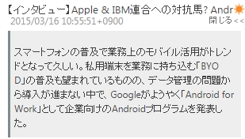
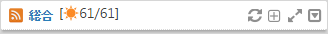

# RSSリーダー

RSSリーダーのコントロールとその操作について説明します。

![RSSリーダー][RSS Reader Gadget]

<table>
    <thead>
        <tr>
            <th>番号</th><th>名前</th><th>説明</th>
        </tr>
    </thead>
    <tbody>
        <tr>
            <td>(1)</td>
            <td>タイトル</td>
            <td>
                

                    ガジェットのタイトルです。 
                    リンクが張られている場合、クリックすると当該サイトのコンテンツを表示します。
                

            </td>
        </tr>
        <tr>
            <td>(2)</td>
            <td>アイコン</td>
            <td>
                

                    RSSリーダーの各機能を実行するコントロール。 
                    各アイコンの説明は以下の表を参照。
                

            </td>
        </tr>
        <tr>
            <td>(3)</td>
            <td>RSSアイテムタイトル</td>
            <td>
                

                    RSSアイテムのタイトル。 
                    リンクをクリックすると当該サイトのコンテンツを表示します。
                

            </td>
        <tr>
        <tr>
            <td>(4)</td>
            <td>新着アイコン</td>
            <td>
                

                    1営業日(デフォルト)以内に更新されたRSSアイテムに付けられます。 
                    最後にinfoScoopを閉じてから1営業日以上経っている場合は、前回の終了時刻以降に更新されたRSSアイテムに新着アイコンが付けられます。
                

            </td>
        </tr>
        <tr>
            <td>(5)</td>
            <td>更新日時/作者名</td>
            <td>
                

                    RSSアイテムの更新日時および作成者(作成者を含む場合のみ表示)
                

            </td>
        </tr>
        <tr>
            <td>(6)</td>
            <td>詳細</td>
            <td>
                

                    詳細リンクをクリックするとRSSアイテムの詳細(コンテンツの要約)を表示します。 
                     
                    [閉じる&#60;&#60;]リンクをクリックすると詳細を閉じます。
                

            </td>
        </tr>
    </tbody>
</table>

## ヘッダアイコンの説明

<table>
    <thead>
        <tr>
            <th>アイコン</th><th>名前</th><th>説明</th>
        </tr>
    </thead>
    <tbody>
        <tr>
            <td></td>
            <td>更新</td>
            <td>
                

                    RSSを再読み込みします。 
                    <b>注意</b> 各RSSリーダーは通常、サーバーで設定された間隔で自動的に更新が行われます。 
                    前回の表示以降に更新されたRSSアイテムに付けられる新着アイコンは回転し情報が新しい事を知らせます。
                

            </td>
        </tr>
        <tr>
            <td></td>
            <td>最小化/新着件数表示</td>
            <td>
                

                    ガジェットを最小化します。「最小化」アイコンは「元に戻す」アイコンに替わります。 
                    最小化すると太陽アイコンが表示され、新着RSSアイテムの件数が表示されます。 
                    RSSアイテムの件数は、新着件数/総件数の順で表示されます。 
                    
                

            </td>
        </tr>
        <tr>
            <td></td>
            <td>新着をすべて表示</td>
            <td>
                

                    ガジェット最小化時にアイコンをクリックすると、1営業日(デフォルト)以内に更新されたRSSアイテムをすべて表示します。 
                    新着アイコンを表示する期間は<a href="global-settings.md" title="全体設定">全体設定</a>により変更可能です。
                

            </td>
        </tr>
        <tr>
            <td>
            <td>元に戻す</td>
            <td>
                

                    最小化されているガジェットを元に戻します。
                

            </td>
        </tr>
        <tr>
            <td></td>
            <td>最大化</td>
            <td>
                

                    ガジェットを最大化します。最大化されたRSSリーダーの説明は次節を参照してください。
                

            </td>
        </tr>
        <tr>
            <td></td>
            <td>メニューを開く</td>
            <td>
                

                    ガジェットのメニューを開きます。
                

            </td>
        </tr>
    </tbody>
</table>

## メニューの説明

メニューを開くアイコン![ガジェットメニュー表示アイコン][Gadget Menu icon]をクリックすると、ガジェットのメニューが開きます。

![ガジェットメニューの表示][Show Gadget menu]

<table>
    <thead>
        <tr>
            <th>アイコン</th><th>名前</th><th>説明</th>
        </tr>
    </thead>
    <tbody>
        <tr>
            <td></td>
            <td>設定</td>
            <td>
                

                    クリックするとガジェット設定が表示されます。 
                     
                    <ul>
                        <li>ガジェットタイトル: 任意のガジェットタイトルを挿入します。</li>
                        <li>改行する: RSSアイテムのタイトルを改行して表示するか、一行で表示できない部分を隠すかどうかを選択します。</li>
                        <li>日付を表示する: 更新日時の表示/非表示を切り替えます。</li>
                        <li>記事表示件数: プルダウンでRSSアイテムの表示件数を選択できます。</li>
                        <li>スクロールモード:
                            <ul>
                                <li>スクロール: スクロール機能を有効にします。</li>
                                <li>スクロールなし: スクロール機能を無効にします。</li>
                            </ul>
                        </li>
                        <li>詳細表示モード: 詳細の表示方法を設定します。
                            <ul>
                                <li>インライン: RSSリーダー内の選択したアイテムの下に詳細を表示します。</li>
                                <li>ポップアップ: 詳細を詳細表示用のポップアップウィンドウに表示します。</li>
                            </ul>
                        </li>
                        <li>コンテンツ表示モード: RSSアイテムのリンクをクリックしたターゲットを設定します。
                            <ul>
                                <li>ポータル内フレーム: ポータル内フレームにリンク先を表示します。</li>
                                <li>新しいウィンドウ: 新しいウィンドウにリンク先を表示します。</li>
                                <li>自動判別: 上記のどちらかについて、システム設定が適用されます。</li>
                            </ul>
                        </li>
                        <li>
                            タイトルで絞り込み: タイトルが指定した条件に合致するRSSアイテムのみが表示されます。 
                            以下の記述が使用できます。
                                <ul>
                                    <li>AND検索: 「A AND B」(AおよびBを含む)</li>
                                    <li>OR検索: 「A OR B」(AまたはBを含む)</li>
                                    <li>NOT検索: 「-A」(Aを含まない)</li>
                                </ul>
                            使用例: (東京 OR 大阪) ニュース -社会
                        </li>
                        <li>作者で絞り込み: 作者名が指定した文字列で始まるRSSアイテムのみが表示されます。</li>
                        <li>カテゴリで絞り込み: カテゴリが指定した文字列と完全一致するRSSアイテムのみが表示されます。</li>
                        <li>アイコン: RSSのソースを表示します。RSSのURLを取得するときなどに使用して下さい。</li>
                    </ul>
                    [CANCEL]: 設定を保存せずにガジェット設定を閉じます。 
                    [OK]: 設定を保存しガジェット設定を閉じます。
                

            </td>
        </tr>
        <tr>
            <td></td>
            <td>表示件数を減らす</td>
            <td>
                
表示するRSSアイテムの件数を1件減らします。

            </td>
        </tr>
        <tr>
            <td></td>
            <td>表示件数を増やす</td>
            <td>
                
表示するRSSアイテムの件数を1件増やします。

            </td>
        </tr>
        <tr>
            <td></td>
            <td>アクセス統計</td>
            <td>
                
RSSのアクセス統計情報を表示します。詳しくは<a href="access-statistics.md" title="アクセス統計">アクセス統計</a>を参照してください。

            </td>
        </tr>
        <tr>
            <td></td>
            <td>検索</td>
            <td>
                

                    検索ボックスにキーワードを入力して、実行ボタンをクリック、またはEnterキーを押すことでサイト内検索を行います。 
                    サイト内検索は、システム設定により有効になっている場合のみ利用できます。
                

            </td>
        </tr>
        <tr>
            <td></td>
            <td>詳細日時表示/非表示</td>
            <td>
                
更新日時の表示/非表示を切り替えます。

            </td>
        </tr>
        <tr>
            <td></td>
            <td>改行有無</td>
            <td>
                
RSSアイテムのタイトルを改行して表示するか、一行で表示できない部分を隠すかどうかを選択します。

            </td>
        </tr>
        <tr>
            <td></td>
            <td>削除</td>
            <td>
                
パーソナライズエリアからガジェットが削除されます。

            </td>
        </tr>
    </tbody>
</table>

## RSSリーダーの最大化

ガジェットヘッダの最大化アイコンをクリックすると、最大化されたRSSガジェットを表示します。

![拡大化RSSリーダー][Maximizing RSS Reader Gadget]

<table>
    <thead>
        <tr>
            <th>番号</th><th>名前</th><th>説明</th>
        </tr>
    </thead>
    <tbody>
        <tr>
            <td>(1)</td>
            <td>RSSアイテムリスト</td>
            <td>
                
RSSのリンクをクリックすると詳細が表示されます。

            </td>
        </tr>
        <tr>
            <td>(2)</td>
            <td>絞り込み設定</td>
            <td>
                

                    <ul>
                        <li>タイトル: タイトルで絞り込んで表示(中間一致、演算子「or」、「not」、「and」を使用可能)</li>
                        <li>作者: 作者名で絞り込んで表示(先頭一致)</li>
                        <li>日付: 期間別に絞り込んで表示</li>
                        <li>カテゴリ: カテゴリで絞り込んで表示(完全一致)</li>
                    </ul>
                

            </td>
        </tr>
        <tr>
            <td>(3)</td>
            <td>アイコン</td>
            <td>
                

                    最大化されたRSSリーダーの機能を実行するコントロール。 
                    各アイコンの説明は以下の表を参照。
                

            </td>
        </tr>
        <tr>
            <td>(4)</td>
            <td>RSSアイテム詳細/コンテンツ表示領域</td>
            <td>
                
RSSの内容を表示します。サマリー表示モード時にはRSSのサマリー情報を、全文表示モード時にはRSSアイテムのリンク先のコンテンツを表示します。

            </td>
        </tr>
        <tr>
            <td>(5)</td>
            <td>幅変更領域</td>
            <td>
                
この領域をドラッグ&ドロップすることでRSSアイテムリストの幅を変更することが出来ます。

            </td>
        </tr>
        <tr>
            <td>(6)</td>
            <td>メール送信</td>
            <td>
                
現在、表示しているRSSアイテムのタイトルをメールでお知らせするための機能。ご利用のメールクライアントが起動します。

            </td>
        </tr>
        <tr>
            <td>(7)</td>
            <td>メッセージを送る</td>
            <td>
                
指定したアカウントのメッセージガジェットに記事のお知らせを送信する機能です。

            </td>
        </tr>
    </tbody>
</table>

## 最大化時のヘッダアイコンの説明

<table>
    <thead>
        <tr>
            <th>アイコン</th><th>名前</th><th>説明</th>
        </tr>
    </thead>
    <tbody>
        <tr>
            <td></td>
            <td>全文表示</td>
            <td>右側の詳細表示パネルをコンテンツ全体をインナーフレームに表示するモードに切り替えます。</td>
        </tr>
        <tr>
            <td></td>
            <td>サマリー表示</td>
            <td>右側の詳細表示パネルをRSSのサマリー情報を表示するモードに切り替えます。</td>
        </tr>
        <tr>
            <td></td>
            <td>詳細日時表示/非表示</td>
            <td>更新日時の表示/非表示を切り替えます。</td>
        </tr>
        <tr>
            <td></td>
            <td>更新</td>
            <td>RSSを再読み込みします。</td>
        </tr>
        <tr>
            <td></td>
            <td>ヘルプ</td>
            <td>ヘルプウィンドウを表示します。</td>
        </tr>
        <tr>
            <td></td>
            <td>元に戻す</td>
            <td>最大化されているガジェットを元に戻します。</td>
        </tr>
    </tbody>
</table>

## 最大化時の詳細表示

RSSリーダーを最大化した場合のコンテンツの詳細表示は、2つのパターンが用意されています。

1. サマリー表示![サマリー表示アイコン][Summary display icon]の時にRSSアイテムをクリック  
   インナーフレーム内に選択したRSSアイテムのサマリー情報が表示されます。  
   ![サマリー表示の画面][Summary display]

1. 全文表示![全文表示アイコン][Full display icon]の時にRSSアイテムをクリック  
   インナーフレーム内に選択したRSSアイテムのコンテンツが表示されます。  
   ![全文表示の画面][Full display]

## キーボードによる操作

RSSリーダーは以下のようなキーにより、キーボードから操作することが可能です。

<table>
    <thead>
        <tr>
            <th>キー</th><th>説明</th>
        </tr>
    </thead>
    <tbody>
        <tr>
            <td>↓↑</td>
            <td>文書間を移動</td>
        </tr>
        <tr>
            <td>→←</td>
            <td>サマリー表示/全文表示の切り替え(/と同様)</td>
        </tr>
        <tr>
            <td>ENTER</td>
            <td>選択した文書のサマリー表示または全文表示</td>
        </tr>
        <tr>
            <td>SHIFT+M</td>
            <td>メール送信</td>
        </tr>
        <tr>
            <td>R</td>
            <td>更新(と同様)</td>
        </tr>
        <tr>
            <td>Q</td>
            <td>元に戻る(最大化解除)(と同様)</td>
        </tr>
        <tr>
            <td>T</td>
            <td>詳細日時表示/非表示(と同様)</td>
        </tr>
        <tr>
            <td>M</td>
            <td>サマリー表示/全文表示の切り替え(/と同様)</td>
        </tr>
        <tr>
            <td>H</td>
            <td>ヘルプの表示(と同様)</td>
        </tr>
    </tbody>
</table>

[RSS Reader Gadget]: images/widget/rss-reader-gadget-1.png "RSSリーダー"
[Show Gadget menu]: images/widget/rss-reader-gadget-4.png "ガジェットメニューの表示"
[Maximizing RSS Reader Gadget]: images/widget/rss-reader-gadget-6.png "拡大化RSSリーダー"
[Summary display]: images/widget/rss-reader-gadget-7.png "サマリー表示の画面"
[Full display]: images/widget/rss-reader-gadget-8.png "全文表示の画面"
[Full display icon]: ../../images/html_valid.png "全文表示アイコン"
[Gadget Menu icon]: ../../images/show_hidden_icons.gif "ガジェットメニュー表示アイコン"
[Summary display icon]: ../../images/html_gray.png "サマリー表示アイコン"
