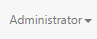
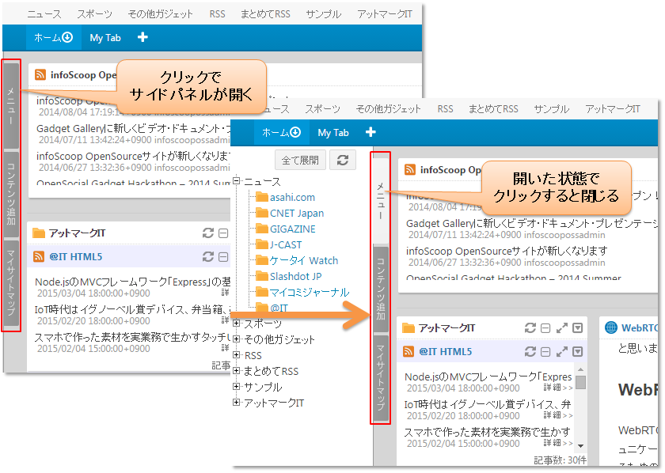

# 画面構成

infoScoopの画面構成について説明します。

## 各パネルの説明

infoScoopは以下のようにいくつかのパネルによって構成されています。

![画面構成][Descriptions of Panels]

<table>
    <thead>
        <tr>
            <th>番号</th><th>名称</th><th>説明</th>
        </tr>
    </thead>
    <tbody>
        <tr>
            <td>(1)</td>
            <td>コマンドバー</td>
            <td>
                コマンドバーでは、以下のコンポーネントを利用することが出来ます。
                <ul>
                    <li>ティッカー(電光掲示板)ガジェット(任意)</li>
                    <li>ランキング(任意)</li>
                    <li>文字サイズ変更アイコン(任意)</li>
                    <li>ごみ箱(任意)</li>
                    <li>全体設定(任意)</li>
                    <li>ガジェット認証情報一覧(任意)</li>
                    <li>検索フォーム(任意)</li>
                    <li>メッセージコンソール(必須)</li>
                    <li>URLリンク(任意)</li>
                </ul>
                ティッカー、検索フォーム以外のコンポーネントは、をクリックすることで表示されます。
            </td>
        </tr>
        <tr>
            <td>(2)</td>
            <td>トップメニュー</td>
            <td>
                システムから全ユーザーに対して提供されるメニューです。 
                メニューには各サイトへのリンク一覧と、サイトがRSSをフィードする場合にはRSSアイコンが表示されています。RSS以外にもガジェットが登録されている場合、対応するアイコンが表示されアイコンをドラッグ&ドロップすることでパーソナライズエリアにガジェットを追加することができます。
            </td>
        </tr>
        <tr>
            <td>(3)</td>
            <td>サイドパネル</td>
            <td>
                [メニュー]: トップメニューの全項目をツリー状に表示したものです。トップメニューと同等の機能を提供します。 
                [コンテンツ追加]: トップメニューにはないRSSやWebサイトを追加するためのコントロールを提供します。 
                [マイサイトマップ]: 各タブのパーソナライズエリアに設置しているガジェットを一覧で表示します。 
                サイドパネルは、各タブをクリックすると開きます。 
                 
                サイドパネルを開くとドラッグ&ドロップで幅を調節できます。調整した幅は保存されません。
            </td>
        </tr>
        <tr>
            <td>(4)</td>
            <td>タブ</td>
            <td>
                1つのブラウザ上で複数のタブを設置可能です。タブ毎に任意のガジェットを配置することができます。
            </td>
        </tr>
        <tr>
            <td>(5)</td>
            <td>固定エリア</td>
            <td>
                システムから全ユーザーに対して共通で提供される情報欄です。このエリアにガジェット(各種情報が表示される矩形の領域)を追加したり、表示されているガジェットをユーザーが移動させることはできません。
            </td>
        </tr>
        <tr>
            <td>(6)</td>
            <td>パーソナライズエリア</td>
            <td>
                各ユーザーが任意にガジェットを配置できる領域です。必要に応じてメニューまたはサイトマップよりガジェットを配置します。
            </td>
        </tr>
    </tbody>
</table>

**注意** 表示されるコンポーネントはサーバー設定によって変更されます。常に上記全てのコンポーネントが表示されるとは限りません。

## ガジェット

infoScoopは、画面上(コマンドバー、固定エリアおよびパーソナライズエリア)に配置されている短形のコンポーネントをガジェットと呼んでいます。  
ガジェットはRSSを表示するRSSリーダーをはじめ様々な種類があります。

以下は、ガジェット(まとめてRSSリーダー)の表示例です。  
![RSSリーダーガジェット][RSS Gadget]

[Descriptions of Panels]: images/layout/screen-layout-1.png "画面構成"
[RSS Gadget]: images/layout/screen-layout-4.png "RSSリーダーガジェット"
