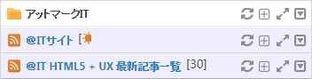
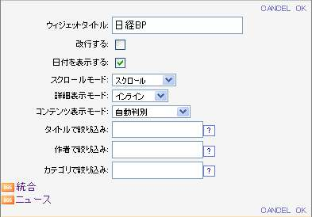

# 复合RSS阅读器

复合RSS阅读器是，把多个RSS阅读器归总起来表示的小工具。

在这节说明复合RSS阅读器的控制和操作。
关于和RSS阅读器功能重复的部分，因为省略请参照[RSS阅读器][RSS Reader Gadget]。

![Composite RSS Reader Gadget]

<table>
    <thead>
        <tr>
            <th>号码</th><th>名称</th><th>说明</th>
        </tr>
    </thead>
    <tbody>
        <tr>
            <td>(1)</td>
            <td>标题</td>
            <td>
                

                    小工具的标题。 
                    张有链接的情况，单击的话会表示该网站的内容。
                

            </td>
        </tr>
        <tr>
            <td>(2)</td>
            <td>图标</td>
            <td>
                

                    执行复合RSS阅读器的各个功能的控制。 
                    各个图标的说明参照下表。
                

            </td>
        </tr>
        <tr>
            <td>(3)</td>
            <td>类别标题</td>
            <td>
                

                    复合RSS阅读器里各类别的标题被表示。 
                    链接被设定的时候，点击后表示被设定的网站。
                

            </td>
        </tr>
        <tr>
            <td>(4)</td>
            <td>类别图标</td>
            <td>
                

                    复合RSS阅读器的标题栏和各类别的标题栏有各自的图标。 
                    标题栏上的图标对RSS阅读器的全类别操作，类别的标题栏对各个类别操作。
                

            </td>
        </tr>
    </tbody>
</table>

## 头图标的说明

<table>
    <thead>
        <tr>
            <th>图标</th><th>名称</th><th>说明</th>
        </tr>
    </thead>
    <tbody>
        <tr>
            <td></td>
            <td>更新</td>
            <td>
                

                    RSS再读入 。 
                    <b>注意</b> 各 RSS阅读器通常以服务器被设定了的间隔自动地更新。 
                    在上次的表示以后被更新的RSS项上将被附加转动的新到图标，以通知信息已被更新。
                

            </td>
        </tr>
        <tr>
            <td></td>
            <td>最小化/新着件数表示</td>
            <td>
                

                    最小化小工具。「最小化」图标替换为「还原」图标。 
                    最小化后太阳图标将被表示。新到的RSS项的件数被表示。 
                    RSS 项的件数以新到件数/总件数的顺序被表示。 
                    
                

            </td>
        </tr>
        <tr>
            <td></td>
            <td>还原</td>
            <td>
                
还原现在被最小化的小工具

            </td>
        </tr>
        <tr>
            <td></td>
            <td>最大化</td>
            <td>
                
最大化小工具。关于被最大化的复合RSS阅读器的说明请参照下一章。

            </td>
        </tr>
        <tr>
            <td></td>
            <td>打开菜单</td>
            <td>
                
打开小工具的菜单。

            </td>
        </tr>
    </tbody>
</table>

## 菜单的说明

单击打开菜单的图标(![Gadget Menu icon])，小工具的菜单就会被展开。

![Gadget menu]

<table>
    <thead>
        <tr>
            <th>图标</th><th>名称</th><th>说明</th>
        </tr>
    </thead>
    <tbody>
        <tr>
            <td></td>
            <td>设定</td>
            <td>
                

                    单击后，小工具设定就被表示。 
                     
                    <ul>
                        <li>小工具标题:插入任意的小工具的标题。</li>
                        <li>换行: 选择RSS项的标题换行表示，或者一行表示不了的隐藏表示。</li>
                        <li>表示日期: 切换更新日期时间的表示/非表示。</li>
                        <li>滚动模式:
                            <ul>
                                <li>滚动：使滚动功能有效。</li>
                                <li>没有滚动条: 使滚动功能无效。</li>
                            </ul>
                        </li>
                        <li>详细表示模式: 设定详细表示的方法。 
                            <ui>
                                <li>内联: 在RSS阅读器里所选项目的下面表示详细信息。</li>
                                <li>弹出: 在弹出窗口里表示详细信息。</li>
                            </ul>
                        </li>
                        <li>内容表示模式: 设定点击RSS项的链接目标。
                            <ul>
                                <li>门户内框架：门户内框里表示链接源。</li>
                                <li>新窗口：新窗口里表示链接源。</li>
                                <li>自动判别：上述中的任意一个被适用于系统设定。</li>
                            </ul>
                        </li>
                        <li>
                            以标题过滤:  只有符合指定的标题条件的RSS项被表示。 
                            但是，这个设定只是在按照时间顺序表示时候被使用 
                            能够使用以下的记述。
                                <ul>
                                    <li>AND检索: 「A B」 （包含A和B）</li>
                                    <li>OR检索: 「A OR B」 （包含A或B）</li>
                                    <li>NOT检索: 「-A」 （不包含A）</li>
                                </ul>
                            使用例：(东京 OR 大阪) 新闻 -社会
                        </li>
                        <li>
                            以作者筛选：只表示以指定作者名的字符串开始的RSS项。 
                            但是，这个设定只是在按照时间顺序表示时候被使用
                        </li>
                        <li>
                            以类别筛选：只表示与指定类别的字符串完全一致的RSS项。 
                            但是，这个设定只是在按照时间顺序表示时候被使用
                        </li>
                        <li>图标: 表示RSS的代码。取得RSS的URL时请使用。</li>
                    </ul>
                    [CANCEL]：不保存设定，关闭小工具设定。 
                    [OK]：保存设定，关闭小工具设定。
                

            </td>
        </tr>
        <tr>
            <td></td>
            <td>减少表示条数</td>
            <td>
                
表示的RSS项件数-1。

            </td>
        </tr>
        <tr>
            <td></td>
            <td>增加表示条数</td>
            <td>
                
表示的RSS项件数+1。

            </td>
        </tr>
        <tr>
            <td></td>
            <td>按照时间顺序表示</td>
            <td>
                

                    整合所有的类别，切换到时间顺序表示。 
                    但是，不正确的日期格式的项被包含时候，不能够按照正确地时间排序。
                

            </td>
        </tr>
        <tr>
            <td></td>
            <td>检索</td>
            <td>
                

                    检索框内输入关键字,点击执行按钮，或者按Enter键会在网站里面执行检索。 
                    网站内的检索只有在系统设定为有效的时候才可以使用。
                

            </td>
        </tr>
        <tr>
            <td></td>
            <td>详细日期的表示/非表示</td>
            <td>
                
切换更新日期的表示/非表示。

            </td>
        </tr>
        <tr>
            <td></td>
            <td>有无换行</td>
            <td>
                
选择RSS项的标题换行表示或者隐藏一行不能表示的部分。

            </td>
        </tr>
        <tr>
            <td></td>
            <td>删除</td>
            <td>
                
从个性化领域上删除小工具。

            </td>
        </tr>
    </tbody>
</table>

## 复合RSS阅读器的最大化

单击小工具首部的最大化图标，显示被最大化的复合RSS阅读器。

![Maximizing Composite RSS Reader Gadget]

根据设定，RSS的项目将显示被登记的类别或者是归总后的全部。这以外的操作和RSS阅读器的最大化一样。最大化时候的操作请参照「<a href="rss-reader-gadget.md#maximize">RSSリーダーの最大化</a>」。

## 类别表示，统合(时间顺序)表示的切换

复合RSS阅读器由不同类别被表示的时候，点击图标后，所有的类别被统合，且按照时间顺序被表示。

统合表示的时候，点击图标，不同类别的RSS图标被表示。

![Display According to Category]

表示类别时，![Display According]图标表示切换成由时间顺序表示。

![Display According to Time Order]

表示统合（时间顺序）时，显示切换类别的图标![Display According]。

## RSS阅读器的归纳

拖菜单或小工具到RSS阅读器或者复合RSS阅读器上的话，归纳的对话框将被显示。

![Merge confirm dialog]

点击[不归纳（返回）]，回到拖拽前的状态。
点击[归纳]， 复合RSS阅读器被追加或生成。

![After merged]

[RSS Reader Gadget]: rss-reader-gadget.md
[Composite RSS Reader Gadget]: images/widget/composite-rss-reader-gadget-1.png
[Gadget menu]: images/widget/composite-rss-reader-gadget-3.png
[Maximizing Composite RSS Reader Gadget]: images/widget/composite-rss-reader-gadget-5.png
[Display According to Category]: images/widget/composite-rss-reader-gadget-6.png
[Display According to Time Order]: images/widget/composite-rss-reader-gadget-7.png
[Merge confirm dialog]: images/widget/composite-rss-reader-gadget-8.png
[After merged]: images/widget/composite-rss-reader-gadget-9.png
[Display According]: ../../images/display_sort.gif
[Gadget Menu icon]: ../../images/show_hidden_icons.gif
