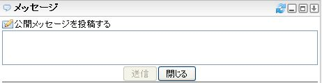
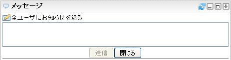
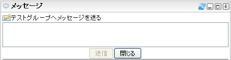
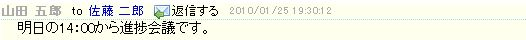
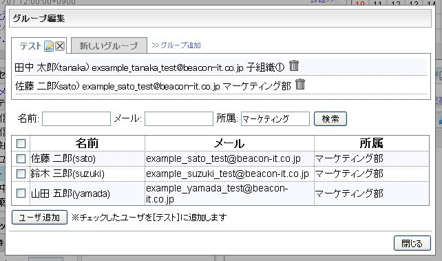

# 信息

关于信息小工具的控制以及操作进行说明。

![message_gadget_jp]

<table>
    <thead>
        <tr>
            <th>号码</th><th>名称</th><th>说明</th>
        </tr>
    </thead>
    <tbody>
        <tr>
            <td>(1)</td>
            <td>标题</td>
            <td>
                

                    小工具的标题。 
                    有链接的时候，点击会表示该网站内容。
                

            </td>
        </tr>
        <tr>
            <td>(2)</td>
            <td>头图标</td>
            <td>
                

                    执行信息的各个功能的控制。 
                    各个图标的说明请参照后述的表。
                

            </td>
        </tr>
        <tr>
            <td>(3)</td>
            <td>公开信息</td>
            <td>
                

                    点击后，信息的输入框被表示。 
                    
                

            </td>
        </tr>
        <tr>
            <td>(4)</td>
            <td>系统组</td>
            <td>
                

                    <ul>
                        <li>
                            收到的消息 
                            点击图标后，表示自己的信息的RSS阅读器会被追加。
                        </li>
                        <li>
                            送出的消息 
                            点击图标后，自己送出的公开信息和表示信息的RSS阅读器被追加。
                        </li>
                        <li>
                            通知 
                            点击图标后，表示已送出的通知信息的RSS阅读器被追加。 
                            点击图标后，表示全用户的公开信息及自己的信息的RSS阅读器被追加。 
                            这个图标如果不被系统设定许可的话，不被表示。 
                            
                        </li>
                        <li>
                            全用户的公开信息 
                            点击图标后，表示全用户的公开信息及自己的信息的RSS阅读器被追加。
                        </li>
                    </ul>
                

            </td>
        </tr>
        <tr>
            <td>(5)</td>
            <td>用户组的头</td>
            <td>
                

                    用户组名称被表示。 
                    点击组名称右侧的图标后，表示用户组所属的全部的用户送信的公开信息以及自己的信息的RSS阅读器被追加。 
                    点击图标，发送给用户组所属的全部用户的信息送信框被表示。 
                    
                

            </td>
        </tr>
        <tr>
            <td>(6)</td>
            <td>用户组</td>
            <td>
                

                    做成的所属用户组的用户一览被表示 
                    点击用户名的右侧的图标，表示对象用户的已发送的公开信息和发送给自己的信息的RSS阅读器被追加。 
                    点击图标后，发送给对象用户的信息送信框被表示。
                

            </td>
        </tr>
    </tbody>
</table>

## 头图标的说明

<table>
    <thead>
        <tr>
            <th>图标</th><th>名称</th><th>说明</th>
        </tr>
    </thead>
    <tbody>
        <tr>
            <td></td>
            <td>更新</td>
            <td>
                

                    检查新到信息。 
                    通常小工具以自动更新间隔（系统设定：默认10分钟）进行检查。手动检查时候点击这个图标。
                

            </td>
        </tr>
        <tr>
            <td></td>
            <td>最小化</td>
            <td>
                
进行小工具的最小化。这个图标切换[还原]图标，点击恢复原来大小。

            </td>
        </tr>
        <tr>
            <td></td>
            <td>还原</td>
            <td>
                
复原最小化的小工具。

            </td>
        </tr>
        <tr>
            <td></td>
            <td>最大化</td>
            <td>
                
小工具最大化。被最大化的信息小工具的说明参照后述。

            </td>
        </tr>
        <tr>
            <td></td>
            <td>打开菜单</td>
            <td>
                
打开小工具的菜单。

            </td>
        </tr>
    </tbody>
</table>

## 菜单的说明

点击打开菜单图标(![Gadget Menu icon])，小工具的菜单会打开。

<table>
    <thead>
        <tr>
            <th>图标</th><th>名称</th><th>说明</th>
        </tr>
    </thead>
    <tbody>
        <tr>
            <td></td>
            <td>组编辑</td>
            <td>表示组编辑窗口。组编辑窗口的说明请参照后述。</td>
        </tr>
        <tr>
            <td></td>
            <td>删除</td>
            <td>小工具从个性化领域上被删除。</td>
        </tr>
    </tbody>
</table>

## 信息小工具的最大化

点击小工具的最大化图标后，会表示被最大化的信息小工具。

![message_gadget_maximize_jp]

<table>
    <thead>
        <tr>
            <th>号码</th><th>名称</th><th>说明</th>
        </tr>
    </thead>
    <tbody>
        <tr>
            <td>(1)</td>
            <td>头图标</td>
            <td>
                

                    执行最大化信息小工具的功能的控制。 
                    各图标的说明参照后述的表。
                

            </td>
        </tr>
        <tr>
            <td>(2)</td>
            <td>公开信息</td>
            <td>
                
点击后表示公开信息的输入框。

            </td>
        </tr>
        <tr>
            <td>(3)</td>
            <td>系统组</td>
            <td>
                

                    <ul>
                        <li>
                            收到的消息 
                            点击后，信息表示笔上自己的信息被表示。
                        </li>
                        <li>
                            送出的消息 
                            点击后，信息表示笔上自己送信的信息(包括公开的信息)被表示。
                        </li>
                        <li>
                            通知 
                            点击后，信息表示笔上通知信息被表示。
                        </li>
                        <li>
                            全用户的公开信息 
                            点击后，信息表示笔上全用户的公开信息以及自己的信息被表示。
                        </li>
                    </ul>
                

            </td>
        </tr>
        <tr>
            <td>(4)</td>
            <td>用户组头</td>
            <td>
                

                    用户组名称被表示。 
                    点击用户组名称，信息表示笔上那个用户组所属的全部的用户的送信公开的信息以及自身的信息被表示。 
                    点击图标，用户组所属的全部的用户的信息送信框被表示。
                

            </td>
        </tr>
        <tr>
            <td>(5)</td>
            <td>用户组</td>
            <td>
                

                    做成的用户组所属的用户的一览被表示。 
                    点击用户名称的话，信息表示笔上对象用户送信公开的信息以及自身的信息被表示。 
                    点击图标，对象用户的信息送信框被表示。
                

            </td>
        </tr>
        <tr>
            <td>(6)</td>
            <td>信息表示笔</td>
            <td>
                

                    被选择的信息的一览被表示。 
                     
                    <ul>
                        <li>
                            用户名称 
                            点击后，和⑤的用户名称点击一样
                        </li>
                        <li>
                            回信 
                            点击后，信息送信的信息的送信框被表示。
                        </li>
                    </ul>
                

            </td>
        </tr>
    </tbody>
</table>

## 最大化时的头图标的说明

<table>
    <thead>
        <tr>
            <th>图标</th><th>名称</th><th>说明</th>
        </tr>
    </thead>
    <tbody>
        <tr>
            <td></td>
            <td>更新</td>
            <td>
                

                    进行检查新到的信息。 
                    通常小工具以自动更新间隔（系统设定：默认10分钟）进行检查。手动检查时候点击这个图标。
                

            </td>
        </tr>
        <tr>
            <td></td>
            <td>组编辑</td>
            <td>
                
表示组编辑窗口。组编辑窗口的说明请参照后述。

            </td>
        </tr>
        <tr>
            <td></td>
            <td>还原</td>
            <td>
                
复原最大化的小工具。

            </td>
        </tr>
    </tbody>
</table>

## 组编辑窗口

系统管理者设定用户搜索时，可以搜索用户再追加到自己建的组里。

![message_gadget_groupmodal_search_jp]

系统管理者没有设定用户搜索时，以下的画面将被显示，这是表示可以指定用户ID追加到自己建的组里。

![message_gadget_nosearch]

<table>
    <thead>
        <tr>
            <th>号码</th><th>名称</th><th>说明</th>
        </tr>
    </thead>
    <tbody>
        <tr>
            <td>(1)</td>
            <td>组标签</td>
            <td>
                

                    登录的组名称被表示。 
                    点击的话，可以变更组名。 
                    点击的话，可以删除组。
                

            </td>
        </tr>
        <tr>
            <td>(2)</td>
            <td>组追加</td>
            <td>
                
点击的话，可以追加要登记的组。

            </td>
        </tr>
        <tr>
            <td>(3)</td>
            <td>用户表示笔</td>
            <td>
                

                    组所属的用户信息以以下的格式被表示。 
                    <code>[用户名称]([用户ID]) [邮件地址] [组织名]</code> 
                    点击的话，从组里删除用户。
                

            </td>
        </tr>
        <tr>
            <td>(4)</td>
            <td>检索框</td>
            <td>
                

                    以用户名，邮件地址，所属组织为条件可以搜索要追加的用户。 
                    输入条件，点击检索按钮，与输入条件中间一致的被搜索，结果的表示如下图。 
                     
                    检索结果的用户名的左复选框加入选中后，点击用户追加按钮，能对组追加用户。
                

            </td>
        </tr>
        <tr>
            <td>(5)</td>
            <td>关闭</td>
            <td>
                
关闭组编辑窗口。

            </td>
        </tr>
        <tr>
            <td>(6)</td>
            <td>用户追加框</td>
            <td>
                
输入用户ID，点击用户追加按钮，能对选中的组追加用户。

            </td>
        </tr>
    </tbody>
</table>

## 新到信息检查

信息小工具每隔自动更新间隔(系统设定：默认10分钟)被更新。另外手动点击![Refresh icon]图标更新的时候，InfoScoop的首部中将显示通知信息。
但是，有时稍微有点时滞。

![message_gadget_notice_jp]

点击通知[收到新的消息。]，信息小工具以最大化的状态被表示。

[message_gadget_jp]: images/widget/message-gadget-1.jpg
[message_gadget_maximize_jp]: images/widget/message-gadget-5.jpg
[message_gadget_groupmodal_search_jp]: images/widget/message-gadget-7.jpg
[message_gadget_nosearch]: images/widget/message-gadget-8.png
[message_gadget_notice_jp]: images/widget/message-gadget-10.jpg
[Gadget Menu icon]: ../../images/show_hidden_icons.gif
[Refresh icon]: ../../images/refresh.gif
