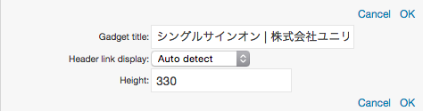

# 迷你浏览器

关于迷你浏览器的追加，从菜单或侧菜单的内容追加标签上([Register an Optional Web Site]参照)进行操作。
以下的画像是对迷你浏览器追加 BeaconIT 的主页的情况。

![MiniBrowser Gadget]

可以自定义的只有标题的变更和小工具高度的调整。
表示另外的网站时，必须再一次从内容追加的面板上重新追加迷你浏览器。

## 图标的说明

<table>
    <thead>
        <tr>
            <th>图标</th><th>名称</th><th>说明</th>
        </tr>
    </thead>
    <tbody>
        <tr>
            <td></td>
            <td>更新</td>
            <td>
                

                    再读取Web页面。 
                    <b>注意</b> 各个迷你浏览器通常以服务器设定的间隔自动更新。
                

            </td>
        </tr>
        <tr>
            <td></td>
            <td>最小化</td>
            <td>
                
最小化小工具。已被最小化的小工具，点击[还原]图标切换的话，回复到原来的大小。

            </td>
        </tr>
        <tr>
            <td></td>
            <td>还原</td>
            <td>
                
最小化的小工具恢复原来状态。

            </td>
        </tr>
        <tr>
            <td></td>
            <td>最大化</td>
            <td>
                
最大化小工具。最大化后，在面板内切换为全画面表示。因为[还原]图标被表示，点击的话，会回到原来的尺寸。

            </td>
        </tr>
        <tr>
            <td></td>
            <td>打开菜单</td>
            <td>
                
打开小工具的菜单。

            </td>
        </tr>
    </tbody>
</table>

## 菜单的说明

点击打开菜单图标(![Gadget Menu icon])，打开小工具的菜单。

![Description of the Menu]

<table>
    <thead>
        <tr>
            <th>图标</th><th>名称</th><th>说明</th>
        </tr>
    </thead>
    <tbody>
        <tr>
            <td></td>
            <td>设定</td>
            <td>
                

                    点击后小工具设定被表示。 
                     
                    <ul>
                        <li>小工具标题：插入任意的小工具标题。</li>
                        <li>
                            表示头连接：设定小工具头的标题链接目的地。 
                            [门户内框架]门户内框里表示链接目的地。  
                            [新窗口] 新窗口里表示链接目的地。  
                            [自动判别] 上述中的任意一个被适用于系统设定。
                        </li>
                        <li>高度：设定小工具高度。高度也可以用拖拽来调整。</li>
                    </ul>
                

            </td>
        </tr>
        <tr>
            <td></td>
            <td>删除</td>
            <td>
                
从个性化领域上删除小工具。

            </td>
        </tr>
    </tbody>
</table>

## 调整高度

把鼠标移至小工具的下方或下方中央处的手柄上，此时为小工具的调整高度模式。用拖放可以调整小工具的高度。

![Adjust the height]

[Register an Optional Web Site]: registering-an-optional-web-site.md
[MiniBrowser Gadget]: images/widget/minibrowser-gadget-1.png
[Gadget Menu icon]: ../../images/show_hidden_icons.gif
[Description of the Menu]: images/widget/minibrowser-gadget-2.png
[Adjust the height]: images/widget/minibrowser-gadget-4.png
