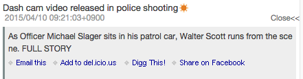

# RSS阅读器

说明一下RSS阅读器的控制及操作。

![RSS Reader Gadget]

<table>
    <thead>
        <tr>
            <th>号码</th><th>名称</th><th>说明</th>
        </tr>
    </thead>
    <tbody>
        <tr>
            <td>(1)</td>
            <td>标题</td>
            <td>
                

                    小工具的标题。 
                    有链接的时候，单击会表示该网站的内容。
                

            </td>
        </tr>
        <tr>
            <td>(2)</td>
            <td>图标</td>
            <td>
                

                    执行RSS阅读器的各个功能的控制。 
                    各个图标的说明参照下表。
                

            </td>
        </tr>
        <tr>
            <td>(3)</td>
            <td>RSS项标题</td>
            <td>
                

                    RSS项标题 
                    点击链接后，该网站的内容会表示。
                

            </td>
        <tr>
        <tr>
            <td>(4)</td>
            <td>新到图标</td>
            <td>
                

                    1个营业日(默认)以内更新了的 RSS 项上会被附加新到图标。 
                    最后关闭infoScoop之后过了1个营业日以上的情况下，前回结束以后被更新的RSS项上会被附加新到图标。
                

            </td>
        </tr>
        <tr>
            <td>(5)</td>
            <td>更新日期时间 / 作者名</td>
            <td>
                

                    RSS项的更新日期时间及作者名(只有在含有作者名时会表示)。
                

            </td>
        </tr>
        <tr>
            <td>(6)</td>
            <td>详细</td>
            <td>
                

                    单击详细链接的话，表示RSS项的详细信息(内容的要点)。 
                     
                    单击[关闭<<]链接的话关闭详细信息。
                

            </td>
        </tr>
    </tbody>
</table>

## 头图标的说明

<table>
    <thead>
        <tr>
            <th>图标</th><th>名称</th><th>说明</th>
        </tr>
    </thead>
    <tbody>
        <tr>
            <td></td>
            <td>更新</td>
            <td>
                

                    RSS再读入 。 
                    <b>注意</b> 各 RSS阅读器通常以服务器被设定了的间隔自动地更新 
                    在上次的表示以后被更新的RSS项上将被附加转动的新到图表，以通知信息已被更新。
                

            </td>
        </tr>
        <tr>
            <td></td>
            <td>最小化 / 新到件数表示</td>
            <td>
                

                    最小化小工具。「最小化」图标替换为「还原」图标。 
                    最小化后太阳图标将被表示。新到的RSS 项的件数被表示。 
                    RSS 项的件数以新到件数/总件数的顺序被表示。 
                    
                

            </td>
        </tr>
        <tr>
            <td></td>
            <td>显示全部的新到信息</td>
            <td>
                

                    小工具最小化的时候，单击图标的话，1营业日(默认)以内被更新了的RSS 项全部被表示。 
                    通过<a href="global-settings.md" title="全体设定">全体设定</a>可以变更新到图标的表示期间。
                

            </td>
        </tr>
        <tr>
            <td>
            <td>还原</td>
            <td>
                

                    还原现在被最小化了的小工具。
                

            </td>
        </tr>
        <tr>
            <td></td>
            <td>最大化</td>
            <td>
                

                    最大化小工具。最大化的RSS阅读器的说明请参照下章。
                

            </td>
        </tr>
        <tr>
            <td></td>
            <td>打开菜单</td>
            <td>
                

                    打开小工具的菜单。
                

            </td>
        </tr>
    </tbody>
</table>

## 菜单的说明

单击打开菜单的图标(![Gadget Menu icon])，小工具的菜单就会打开。

![Show Gadget menu]

<table>
    <thead>
        <tr>
            <th>图标</th><th>名称</th><th>说明</th>
        </tr>
    </thead>
    <tbody>
        <tr>
            <td></td>
            <td>设定</td>
            <td>
                

                    单击后，小工具设定就被表示。 
                     
                    <ul>
                        <li>小工具标题：插入任意的小工具的标题。</li>
                        <li>换行：选择RSS项的标题换行表示或者隐藏一行不能表示的部分。</li>
                        <li>表示日期：切换更新日期时间的表示/非表示。</li>
                        <li>项目表示件数: 能以下拉的方式选择RSS项的表示件数。</li>
                        <li>滚动模式:
                            <ul>
                                <li>滚动：使滚动功能有效。</li>
                                <li>没有滚动条: 使滚动功能无效。</li>
                            </ul>
                        </li>
                        <li>详细表示模式: 设定详细表示的方法。 
                            <ul>
                                <li>内联: 在RSS阅读器里所选项目的下面表示详细信息。</li>
                                <li>弹出: 在弹出窗口里表示详细信息。</li>
                            </ul>
                        </li>
                        <li>内容表示模式: 设定点击RSS项的链接目标。
                            <ul>
                                <li>门户内框架：门户内框里表示链接源。</li>
                                <li>新窗口：新窗口里表示链接源。</li>
                                <li>自动判别：上述中的任意一个被适用于系统设定。</li>
                            </ul>
                        </li>
                        <li>
                            以标题过滤:  只有符合指定的标题条件的RSS项被表示。 
                            能够使用以下的记述。
                                <ul>
                                    <li>AND检索: 「A B」 （包含A和B）</li>
                                    <li>OR检索: 「A OR B」 （包含A或B）</li>
                                    <li>NOT检索: 「-A」 （不包含A）</li>
                                </ul>
                            使用例：(东京 OR 大阪) 新闻 -社会
                        </li>
                        <li>以作者过滤: 只表示以指定作者名的字符串开始RSS项。</li>
                        <li>以类别过滤: 只表示与指定类别的字符串完全一致的RSS项。</li>
                        <li>图标：表示RSS的代码。取得RSS的URL时请使用。</li>
                    </ul>
                    [CANCEL]：不保存设定，关闭小工具设定。 
                    [OK]：保存设定，关闭小工具设定。
                

            </td>
        </tr>
        <tr>
            <td></td>
            <td>减少表示条数</td>
            <td>
                
表示的RSS项件数-1。

            </td>
        </tr>
        <tr>
            <td></td>
            <td>增加表示条数</td>
            <td>
                
表示的RSS项件数+1。

            </td>
        </tr>
        <tr>
            <td></td>
            <td>访问统计</td>
            <td>
                
表示RSS的访问统计信息。详细请参照「<a href="access-statistics.md" title="访问统计">访问统计</a>」

            </td>
        </tr>
        <tr>
            <td></td>
            <td>检索</td>
            <td>
                

                    检索框内输入关键字,点击执行按钮，或者按Enter键会在网站里面执行检索。 
                    网站内的检索，只有,系统设定为有效的时候才可使用。
                

            </td>
        </tr>
        <tr>
            <td></td>
            <td>详细日期的表示/非表示</td>
            <td>
                
切换更新日期的表示/非表示。

            </td>
        </tr>
        <tr>
            <td></td>
            <td>有无换行</td>
            <td>
                
选择RSS项的标题换行表示或者隐藏一行不能表示的部分。

            </td>
        </tr>
        <tr>
            <td></td>
            <td>删除</td>
            <td>
                
从个性化领域上删除小工具。

            </td>
        </tr>
    </tbody>
</table>

## RSS阅读器的最大化

单击小工具首部的最大化图标，表示被最大化的RSS小工具。

![Maximizing RSS Reader Gadget]

<table>
    <thead>
        <tr>
            <th>号码</th><th>名称</th><th>说明</th>
        </tr>
    </thead>
    <tbody>
        <tr>
            <td>(1)</td>
            <td>RSS项一览表</td>
            <td>
                
单击RSS链接，详细被表示。

            </td>
        </tr>
        <tr>
            <td>(2)</td>
            <td>筛选设定</td>
            <td>
                

                    <ul>
                        <li>标题：用标题筛选后表示（中间一致，使用可能运算符「or」，「not」，「and」）</li>
                        <li>作者：以作者名筛选表示（先头一致）</li>
                        <li>日期：以期间别筛选后表示</li>
                        <li>类别：以类别筛选后表示（完全一致）</li>
                    </ul>
                

            </td>
        </tr>
        <tr>
            <td>(3)</td>
            <td>图标</td>
            <td>
                

                    执行被最大化RSS阅读器功能的控制。 
                    各图标的说明参照下表。
                

            </td>
        </tr>
        <tr>
            <td>(4)</td>
            <td>RSS项详细/内容表示领域</td>
            <td>
                
表示RSS的内容。摘要模式时RSS的摘要和全文表示模式时RSS项的链接内容被表示。

            </td>
        </tr>
        <tr>
            <td>(5)</td>
            <td>幅变更领域</td>
            <td>
                
拖放这个区域，可以变更RSS项目一览表的幅度。

            </td>
        </tr>
        <tr>
            <td>(6)</td>
            <td>邮件送信</td>
            <td>
                
现在，表示的RSS项的标题以邮件通知的功能。利用的邮件客户端软件被启动。

            </td>
        </tr>
        <tr>
            <td>(7)</td>
            <td>发送信息</td>
            <td>
                
对指定的用户的信息小工具记事的通知送信功能。

            </td>
        </tr>
    </tbody>
</table>

## 最大化时的头图标的说明

<table>
    <thead>
        <tr>
            <th>图标</th><th>名称</th><th>说明</th>
        </tr>
    </thead>
    <tbody>
        <tr>
            <td></td>
            <td>全文表示</td>
            <td>把右边的详细表示面板切换成内容全体内框表示模式。</td>
        </tr>
        <tr>
            <td></td>
            <td>摘要表示</td>
            <td>把右边的详细表示面板切换成RSS的摘要信息表示模式。</td>
        </tr>
        <tr>
            <td></td>
            <td>详细日期的表示/非表示</td>
            <td>切换更新日期时间的表示/非表示。</td>
        </tr>
        <tr>
            <td></td>
            <td>更新</td>
            <td>RSS的再读取</td>
        </tr>
        <tr>
            <td></td>
            <td>帮助</td>
            <td>显示帮助窗口。</td>
        </tr>
        <tr>
            <td></td>
            <td>还原</td>
            <td>最大化的窗口还原。</td>
        </tr>
    </tbody>
</table>

## 最大化的详细表示

对于RSS阅读器最大化时候的内容的详细表示，准备了两种方式。

1. ![Summary display icon] (摘要表示)的时候，单击RSS项
   所选的RSS项目的摘要信息在内框里被显示。
   ![Summary display]

1. ![Full display icon]（全文表示）的时候点击RSS项
   所选的RSS项目的内容在内框里被显示。
   ![Full display]

## 键盘的操作

RSS读取器从键盘用以下的键可以操作。

<table>
    <thead>
        <tr>
            <th>键</th><th>说明</th>
        </tr>
    </thead>
    <tbody>
        <tr>
            <td>↓↑</td>
            <td>在文本间移动</td>
        </tr>
        <tr>
            <td>→←</td>
            <td>切换摘要表示/全文表示（和一样/)</td>
        </tr>
        <tr>
            <td>ENTER</td>
            <td>选择的文本的摘要表示或全文表示</td>
        </tr>
        <tr>
            <td>SHIFT+M</td>
            <td>邮件送信</td>
        </tr>
        <tr>
            <td>R</td>
            <td>更新(和一样)</td>
        </tr>
        <tr>
            <td>Q</td>
            <td>还原（解除最大化）(和一样)</td>
        </tr>
        <tr>
            <td>T</td>
            <td>详细日期时间表示/非表示(和一样)</td>
        </tr>
        <tr>
            <td>M</td>
            <td>切换摘要表示/全文表示(和一样/)</td>
        </tr>
        <tr>
            <td>H</td>
            <td>帮助的表示(和一样)</td>
        </tr>
    </tbody>
</table>

[RSS Reader Gadget]: images/widget/rss-reader-gadget-1.png
[Show Gadget menu]: images/widget/rss-reader-gadget-4.png
[Maximizing RSS Reader Gadget]: images/widget/rss-reader-gadget-6.png
[Summary display]: images/widget/rss-reader-gadget-7.png
[Full display]: images/widget/rss-reader-gadget-8.png
[Full display icon]: ../../images/html_valid.png
[Gadget Menu icon]: ../../images/show_hidden_icons.gif
[Summary display icon]: ../../images/html_gray.png
