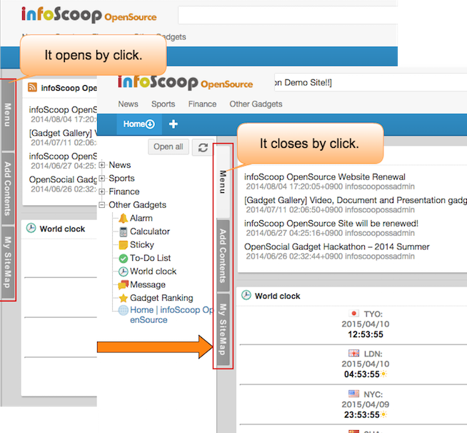

# 界面构成

关于infoScoop的界面构成进行说明。

## 各面板的说明

infoScoop如下图所示，由若干个面板所构成。

![画面构成][Descriptions of Panels]

<table>
    <thead>
        <tr>
            <th>号码</th><th>名称</th><th>说明</th>
        </tr>
    </thead>
    <tbody>
        <tr>
            <td>(1)</td>
            <td>首部</td>
            <td>
                网站的标志·名称·搜索栏等被表示的领域。
            </td>
        </tr>
        <tr>
            <td>(2)</td>
            <td>顶部菜单</td>
            <td>
                系统对于全部用户提供的菜单。 
                在菜单里(上)，各网站的链接一览表以及若是提供RSS的网站那么RSS图标会被表示。 在登录RSS阅读器以外的小工具的时候，对应的图标被表示，通过拖放小工具也能够被追加到个性化领域。
            </td>
        </tr>
        <tr>
            <td>(3)</td>
            <td>侧面板</td>
            <td>
                [菜单]:顶部菜单的全项目以树状形式表示。和顶部菜单提供同样的功能。 
                [内容追加]:提供为了对于顶部菜单没有的RSS和追加网站的控制。 
                [我的网站地图]：为各标签的用户面板设置的小工具用一览表示。 
                点击侧面板的各个标签后会打开。 
                 
                打开侧面板后，用拖放可以调节幅度，调节的幅度不被保存。
            </td>
        </tr>
        <tr>
            <td>(4)</td>
            <td>命令栏</td>
            <td>
                命令栏能利用以下的组件
                <ul>
                    <li>电光广告牌(任意)</li>
                    <li>首页(任意)</li>
                    <li>热门搜索(任意)</li>
                    <li>更改字体大小图标(任意)</li>
                    <li>回收站(任意)</li>
                    <li>全体设定(任意)</li>
                    <li>小工具认证信息一览(任意)</li>
                    <li>信息控制台 (必需)</li>
                    <li>URL链接(任意)</li>
                </ul>
            </td>
        </tr>
        <tr>
            <td>(5)</td>
            <td>标签</td>
            <td>
                可以在1个浏览器上设置复数的标签。每个标签能配置任意的小工具。
            </td>
        </tr>
        <tr>
            <td>(6)</td>
            <td>固定领域</td>
            <td>
                是系统对于全部的用户提供的共同信息栏。用户不能够对这个面板追加小工具(各种信息被表示的矩形的领域)，也不能够移动被显示的小工具。
            </td>
        </tr>
        <tr>
            <td>(7)</td>
            <td>个性化领域</td>
            <td>
                是各用户可以随意配置小工具的领域。按照必要菜单或自网站地图配置RSS信息。
            </td>
        </tr>
    </tbody>
</table>

**注意** 被表示的组件会通过服务器的设定而改变。上述的全部组件不一定总是都被表示。

## 小工具

infoScoop界面上(命令栏，固定领域及个性化领域)被配置的矩形的组件称为『小工具』

小工具以表示RSS的RSS阅读器为代表有各种各样的种类。
小工具(复合RSS阅读器)的图例如下。

![复合RSS阅读器][RSS Gadget]

[Descriptions of Panels]: images/layout/screen-layout-1.png "画面构成"
[RSS Gadget]: images/layout/screen-layout-4.png "复合RSS阅读器"
